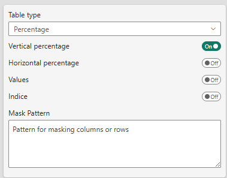

# Explore Table Features - Detailed Walkthrough

## Overview

SDM Cross Table Tool offers extensive customization options organized into logical sections in the Format panel. This guide walks you through each feature section, explaining what it does and where to learn more.

---

## 1. Table Contents


**What it controls**: The fundamental data display and aggregation settings

This section determines:
- Table type (Percentage vs Mean)
- Which metrics to display (values, percentages, indices)
- Data masking patterns
- Multiple answer mode configuration

**Key decisions here**:
- Choose between percentage analysis or mean analysis
- Toggle vertical/horizontal percentages
- Enable indice calculations
- Set up masking patterns for sensitive data

**When to use**: Configure this section first, as it defines what your table displays and how data is aggregated.

📖 **Learn more**: [Table Contents Reference](../04-reference/table-content.md)

---

## 2. Sorting Settings

**What it controls**: How rows and columns are arranged in your table

This section allows you to:
- Sort rows alphabetically or by column values
- Specify sorting direction (ascending/descending)
- Pin specific rows/columns to first or last positions
- Choose which metric to sort by (value, percentage, indice)

**Key decisions here**:
- Alphabetical sorting for consistency
- Value-based sorting for insights (highest sales first)
- Fixed positioning for totals and special categories

**When to use**: After your data is displaying correctly, configure sorting to highlight insights or maintain consistent presentation.

📖 **Learn more**: [Sorting & Ordering Reference](../04-reference/sorting.md)

---

## 3. Ranking Settings

**What it controls**: Visual highlighting of top/bottom performers

:::info Edition Availability
Ranking is available in **Pro** and **Premium** editions only.
:::

This composite section includes:
- **Basic Settings**: Ranking scope, order, and display method
- **Custom Colors**: Define your own color gradients
- **Exclude Range**: Prevent middle values from being colored

**Key decisions here**:
- Choose ranking scope (global, per row, per column)
- Select display format (numbered badges or color gradients)
- Configure color intensity and schemes

**When to use**: Add ranking after basic table setup to visually emphasize performance differences.

📖 **Learn more**: [Ranking & Visualization Reference](../04-reference/ranking.md)

---

## 4. % Series Usage

**What it controls**: Data series mapping for percentage tables

This section appears when **Table Type** is set to "Percentage" and manages:
- Value series (the counts to display)
- Base series (denominators for percentages)
- Unweighted base series
- Significance testing series
- Multiple answer mode toggle

**Key decisions here**:
- Map your data measures to appropriate series
- Configure weighted vs unweighted bases
- Set up series for statistical testing

**When to use**: Essential for percentage tables with custom measures or weighted data.

📖 **Learn more**: [Percentage Series Configuration](../04-reference/percentage-series.md)

---

## 5. Mean Series Usage

**What it controls**: Data series mapping for mean tables

This section appears when **Table Type** is set to "Mean" and manages:
- Mean series (the averages to display)
- Count series (sample sizes)
- Standard deviation series
- Significance testing series for means
- Unweighted base series

**Key decisions here**:
- Map your numerical measures
- Include sample size information
- Configure standard deviation for statistical analysis

**When to use**: Essential for mean tables to properly aggregate and display average values.

📖 **Learn more**: [Mean Series Configuration](../04-reference/mean-series.md)

---

## 6. Significance Settings

**What it controls**: Statistical testing and difference highlighting

:::info Edition Availability
- Basic significance testing: **Pro** and **Premium**
- Advanced testing (2 tests, regex): **Premium** only
:::

This composite section includes:
- **Base Settings**: Test types, confidence levels, variance methods
- **Test 1 Configuration**: Display and comparison options
- **Test 2 Configuration**: (Premium only) Additional test layer

**Key decisions here**:
- Choose test type (all columns, item vs total, regex)
- Set confidence level (90%, 95%, 99%)
- Select visual display method (icon, color, border)

**When to use**: When you need to highlight statistically significant differences between groups.

📖 **Learn more**: [Significance Testing Reference](../04-reference/significance.md)

---

## 7. Totals

**What it controls**: Display of total rows, base rows, and subtotals

This section manages:
- Total column display
- Base row configuration
- Unweighted base row
- Subtotals for hierarchical levels
- Base row positioning (top/bottom)
- Custom labels for special rows

**Key decisions here**:
- Show/hide totals and bases
- Position base rows at top or bottom
- Customize row labels
- Configure subtotals for multi-level tables

**When to use**: Configure after basic table setup to add context rows.

📖 **Learn more**: [Totals & Subtotals Reference](../04-reference/totals.md)

---

## 8. Threshold

**What it controls**: Data quality warnings and value masking

:::info Edition Availability
Threshold features are available in **Pro** and **Premium** editions.
:::

This section allows you to:
- Set warning thresholds (visual alerts)
- Set masking thresholds (hide values)
- Choose threshold basis (cell value, base, unweighted base)
- Configure empty cell display for zero values

**Key decisions here**:
- Warning level for small sample sizes
- Masking level for data protection
- What to base thresholds on

**When to use**: Important for survey data or any analysis with variable sample sizes.

📖 **Learn more**: [Thresholds & Masking Reference](../04-reference/thresholds.md)

---

## 9. Table Format Settings

**What it controls**: Visual appearance and styling

This composite section includes multiple cards:

### Table Options Card
- Hover highlighting
- Zebra rows
- Selection mode
- Percentage symbol display
- Decimal precision
- Freeze panes
- Row title width
- Column header visibility

### Style Settings Card
- Pre-defined style themes (Custom, Modern, Classic, Scientific, Market Research)
- Cell text size
- Color themes (20+ options)
- Row title text alignment

### Element Formatting Cards
- **Top Level Header**: Fonts, colors, backgrounds
- **Sub Level Header**: Hierarchical header styling  
- **Cell Format**: Data cell appearance

**Key decisions here**:
- Choose a theme or create custom styling
- Set freeze panes for navigation
- Configure fonts and colors for branding
- Adjust decimal precision for your audience

**When to use**: Configure styling after data and structure are finalized, or apply pre-defined themes immediately for quick professional appearance.

📖 **Learn more**: [Formatting & Styling Reference](../04-reference/formatting.md)

---

## Typical Configuration Workflow

Here's a recommended order for configuring your table:

### Phase 1: Foundation (Required)
1. **Table Contents**: Choose table type, select what to display
2. **Series Configuration**: Map your data (% or Mean series)
3. **Totals**: Add base rows and total columns

### Phase 2: Analysis (Optional)
4. **Sorting**: Arrange for insights or consistency
5. **Significance**: Highlight statistical differences (Pro/Premium)
6. **Ranking**: Visual performance indicators (Pro/Premium)
7. **Thresholds**: Data quality controls (Pro/Premium)

### Phase 3: Presentation (Final)
8. **Table Format**: Apply styling and themes
9. **Fine-tune**: Adjust fonts, colors, precision

---

## Feature Dependencies

Some features depend on others:

| Feature | Requires | Edition |
|---------|----------|---------|
| **Vertical %** | Base series configured | All |
| **Significance Testing** | Significance series configured | Pro+ |
| **Ranking** | Ranking enabled | Pro+ |
| **Indice** | Value and base series | Premium |
| **Threshold Masking** | Threshold enabled | Pro+ |

---

## Quick Reference: What Each Section Does

| Section | Primary Purpose | When to Configure |
|---------|----------------|-------------------|
| **Table Contents** | Define data type and display | First |
| **Sorting** | Arrange rows/columns | After data displays |
| **Ranking** | Visual highlights | After basic setup |
| **% Series** | Map percentage data | With Table Contents |
| **Mean Series** | Map mean data | With Table Contents |
| **Significance** | Statistical testing | After analysis decisions |
| **Totals** | Context rows | After basic setup |
| **Threshold** | Data quality | After totals |
| **Table Format** | Visual styling | Last (or use themes first) |

---

## Common Configuration Scenarios

### Scenario 1: Simple Survey Report
```
1. Table Contents: Percentage table, vertical %
2. Totals: Show total column, base row
3. Table Format: Apply "Market Research" theme
→ Done!
```

### Scenario 2: Performance Analysis with Ranking
```
1. Table Contents: Percentage table, vertical %
2. Sorting: Sort by "Total" column, descending
3. Ranking: Enable ranking, color gradient
4. Totals: Total column, base row at top
5. Table Format: "Modern" theme
→ Highlights top performers automatically
```

### Scenario 3: Statistical Comparison (Premium)
```
1. Table Contents: Percentage, vertical % + horizontal %
2. % Series: Configure all series including significance
3. Significance: Test 1 = All columns, Test 2 = vs Total
4. Totals: Base row, signif base row
5. Threshold: Warn below n=50
6. Table Format: Custom styling for brand
→ Full statistical analysis table
```

---

## Next Steps

Now that you understand what each section does:

1. **Start Simple**: Configure Table Contents and Totals first
2. **Add Analysis**: Try Sorting or Ranking
3. **Go Advanced**: Explore Significance and Thresholds (Pro/Premium)
4. **Polish**: Apply themes or customize formatting

📖 **Reference Guides**: Explore detailed settings for each section using the links above

🎯 **Use Cases**: See real-world examples in [Business Cases](../03-use-cases/business-cases.md)

❓ **Need Help?**: Start with the [Quick Start Guide](quick-start.md) for basics

---

## Troubleshooting by Section

**Table displays incorrectly**  
→ Check: Table Contents, Series Configuration

**Can't find my data**  
→ Check: Table Contents (masking), Series Configuration

**Numbers don't add up**  
→ Check: Series Configuration, Totals settings

**Visual appearance issues**  
→ Check: Table Format Settings (fonts, colors, precision)

**Ranking/Significance not working**  
→ Check: Edition requirements, Series Configuration

For detailed troubleshooting, see each section's reference guide.