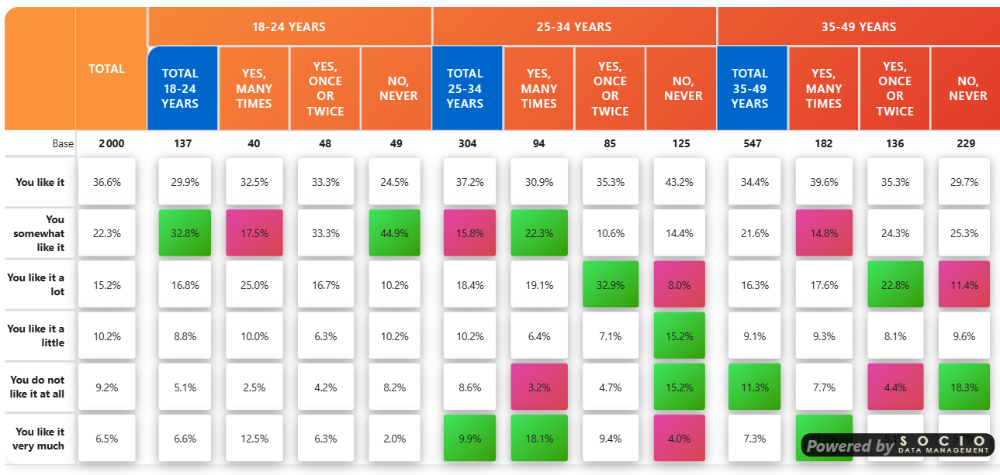

# Tile Mode Reference

Render each cell (or sub-cell) as a detached tile with rounded corners, optional drop shadow, configurable padding and column/row gaps. Tile Mode transforms the table from a classic grid into a card-like layout while keeping the underlying HTML `<table>` structure intact — all existing features (significance, ranking, thresholds, sticky columns, sorting, masking…) continue to work.

:::info[Settings Location]
These settings correspond to the **`cellTileSettingsCard`** in the configuration model, under the **Table Format** card.
:::

---

## Overview

Tile Mode is a non-destructive visual layer:

- **OFF (default)**: classic grid rendering, no change to existing behavior.
- **ON**: each cell becomes a detached tile with its own background, rounded corners, shadow, and configurable spacing.

The mode works across all five style themes (Modern, Classic, Scientific, Market Research, Custom).

---

## Master Switch

### Tile mode

**Setting**: Tile mode (toggle)
**Default**: Off

When enabled, the whole tile system activates: cell wrapping, sub-cell tiling, gaps, gradient backgrounds for significance, etc.

When disabled, the table renders exactly as before — no impact whatsoever.

---

## Tile Appearance

### Tile corner radius (px)

**Type**: Number (px)
**Default**: 8

Rounded corner radius of each tile. Larger values create softer, more "card-like" tiles. Set to `0` for square tiles.

### Tile horizontal padding (px)

**Type**: Number (px)
**Default**: 4

Internal left/right padding inside each tile. Increases the horizontal breathing room around the value.

### Tile vertical padding (px)

**Type**: Number (px)
**Default**: 4

Internal top/bottom padding inside each tile. Use a higher value (e.g. 8-12) to create visually taller tiles.

:::tip[Independent H/V padding]
Horizontal and vertical padding are independent. A common pattern is a smaller horizontal padding with a larger vertical one to make tiles slightly taller without making them wider.
:::

### Drop shadow

**Setting**: Drop shadow (toggle)
**Default**: On

Adds a soft drop shadow below each tile for a floating, card-like effect.

### Shadow intensity (1-30)

**Type**: Number (1 to 30)
**Default**: 6

Controls the shadow's depth and spread:

| Value | Effect |
|-------|--------|
| 1-3   | Very subtle — barely perceptible |
| 4-8   | Soft — good for clean layouts |
| 10-15 | Pronounced — clear floating effect |
| 20-30 | Strong — dramatic, presentation-grade |

The shadow is composed of two layers (a wide soft layer and a tighter dense layer) so it stays elegant even at high intensities.

### Tile background

**Setting**: Tile background (color)
**Default**: `#ffffff` (white)

Background color of non-significant tiles. Tiles that are significant (positive or negative) use the significance colors instead — see [Significance settings](../significance.md).

---

## Tile Width

### Tile width

**Type**: Text
**Default**: `-1` (auto)

Controls the width of every tile in the table. Two modes:

| Value | Behavior |
|-------|----------|
| `-1`, empty, or `auto` | **Auto-equalize**: every tile gets the width of the widest natural cell (measured after rendering). Recommended when displaying logos or when column headers are hidden — otherwise columns can end up with very different widths. |
| `60`, `60px`, `5em`, `2.5rem` | **Explicit**: forces an exact width on every tile. A bare number is interpreted as pixels. |

Invalid values (e.g. `abc`) fall back to auto.

:::tip[When to use explicit width]
- When column headers are hidden (`Show column header` = off): tiles have no header to constrain their width, and they may stretch differently per row. Use auto or explicit to enforce consistency.
- When logos of different sizes appear in headers: auto width measures each cell after image decoding and aligns them.
- When you need very compact columns: set an explicit small width (e.g. `45px`).
:::

---

## Inter-Tile Spacing (Gaps)

Gaps create visual breathing room between tiles. They are implemented via transparent borders, which add real physical width without altering the tile content.

All horizontal gaps are split **symmetrically** between the two adjacent tiles (half on the right of the previous tile, half on the left of the next).

### Sub-cell gap (px)

**Type**: Number (px)
**Default**: 4

Gap between sub-cells inside a multi-value cell (when 2, 3 or 4 measures are displayed per cell). Higher values clearly separate the value, percentage, indice, etc.

### Group gap (px)

**Type**: Number (px)
**Default**: 16

Extra horizontal space inserted at the start of each top-level column group (level 1). For example, between two countries in a `Country > Brand` hierarchy.

The same gap is also inserted:

- Between the **Grand Total** column and the first data column (or first sub-total) that follows.
- Between two top-level column groups.

### Sub-group gap (px)

**Type**: Number (px)
**Default**: 8

Extra horizontal space inserted at the start of each second-level column sub-group (level 2). For example, between two brands within a country.

The same gap is also inserted:

- Between a **sub-total** column (Total Lv1 / Lv2) and the first data column of the group that follows.

### Row gap (px)

**Type**: Number (px)
**Default**: 0

Vertical space between rows. Like horizontal gaps, the value is split symmetrically (half added below each row, half above the next), so a value of `8` produces an 8-pixel visual gap between any two consecutive rows.

A value of `0` keeps rows tightly stacked (the classic table look). Set to 4-8 for a more airy, card-style layout.

---

## Interactions with Other Features

Tile Mode is designed to coexist with the rest of the visual:

### Significance tests

Significance backgrounds (positive/negative) are applied to the **inner tile**, not the `<td>` placeholder — so the colored area respects the tile's rounded corners and shadow.

In multi-value cells, the colored sub-tile is the one carrying the significant measure (e.g. the pctV sub-tile).

You can combine Tile Mode with **gradient significance backgrounds**: see the [Significance settings](../significance.md) — the gradient is applied to the tile itself.

### Ranking

In single-value tile cells, ranking visuals are applied to the inner tile:

- **Rank label** (numeric badge): positioned against the tile's left edge.
- **Color scale** (red→blue / red→green / custom): the gradient color is applied to the tile background, not the transparent `<td>`. The auto-contrast text color also targets the tile.

### Thresholds

In Tile Mode, threshold behavior is friendlier:

- **Mask threshold** (cell base below threshold): renders an **empty tile** (visible card with no content) instead of the `---` text used in classic mode. Cleaner visual.
- **Warning threshold**: the ⚠️ icon is inserted **inside** the tile (single-value: before the value; multi-value: in the first sub-tile), not next to it.

### Logos in headers

When logos are enabled and tiles are wider than usual, set **Tile width** to auto so every tile matches the widest header logo (post-decoding).

### Sticky columns / freeze

Sticky row headers continue to work normally. Their background is preserved by the tile mode CSS (only `<td>` data cells become transparent placeholders).

### Side-by-side mode

The classic side-by-side separator (a 2px border between sub-tables) is kept independent of the tile group gaps.

---

## Display Modes Summary

| When you want… | Set… |
|----------------|------|
| Subtle card effect | radius 6-8, shadow intensity 4-6, padding 4/4 |
| Strong card effect | radius 10-12, shadow intensity 12-18, padding 6/8 |
| Dense layout | radius 4, shadow off, padding 2/2, sub-cell gap 2 |
| Airy / dashboard | radius 10, shadow 8, padding 6/10, row gap 6, group gap 24 |
| Magazine-like | radius 14, shadow 20, padding 8/12, row gap 8, group gap 32 |

---

## Behavior When Tile Mode Is Off

If Tile mode is OFF:

- None of the tile CSS is injected.
- All sliders / colors / gaps are ignored.
- The table renders identically to previous versions.

This means you can keep your existing reports untouched and only enable Tile Mode where you want the new look.

---

## Performance Notes

- **Equalizing tile widths (auto mode)**: a synchronous measure pass runs after rendering, plus a deferred remeasure when images (logos) finish decoding. The cost is negligible for tables up to a few thousand cells.
- **Shadows**: composed of two `box-shadow` layers per tile. Very high intensities on very large tables can slow down scrolling on low-end devices — use intensities ≤ 20 in production reports with 1000+ cells.

---

## Related Topics

- [Custom Element Formatting](formatting-custom.md) — override fonts/colors per element (works alongside tile mode)
- [Significance settings](../significance.md) — gradient backgrounds use the tile as a target
- [Thresholds](../thresholds.md) — mask/warning behave differently in tile mode
- [Ranking](../ranking.md) — color scales apply to the inner tile
- [Formatting Overview](index.md) — all formatting options
