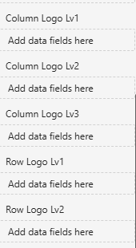
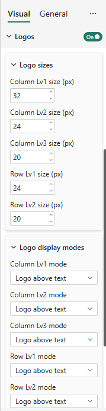
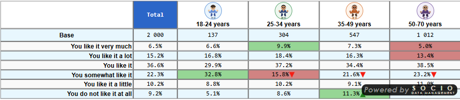
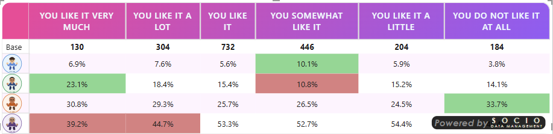

# Logos in Headers Reference

## Overview

Logos let you display **images inside row and column headers** — for example company or brand logos in a competitor comparison, or product icons in a key-account table.

Each header level has its own image field. You bind a **DAX measure that returns a base64 image** to that field, then control how and how big the logo appears from the **Logos** card in the Format pane.

:::info[No external URLs]
Logos are provided as **base64 data URIs** through the visual's data fields — never as an external URL. Every image is passed through `sanitizeImageDataUri` before being rendered, keeping the visual certification-safe (see [Security & certification](#security--certification)).
:::

---

## Data Fields (Series)

Logos are bound through **five dedicated data fields**, one per header level:

| Field | Applies to | Header level |
|---|---|---|
| `colLogoLv1` | Columns | Level 1 (outermost) |
| `colLogoLv2` | Columns | Level 2 |
| `colLogoLv3` | Columns | Level 3 |
| `rowLogoLv1` | Rows | Level 1 (outermost) |
| `rowLogoLv2` | Rows | Level 2 |

Each field accepts a **measure returning a base64-encoded image** (PNG, JPEG…), typically in the form:

```
data:image/png;base64,iVBORw0KGgoAAAANS...
```

A common pattern is a DAX measure that looks up the logo for the current header value:

```dax
Brand Logo =
SELECTEDVALUE( Brands[LogoBase64] )
```

Bind that measure to the field matching the level where the brand appears (`colLogoLv1` if brands are the first column level, `rowLogoLv1` if they are the first row level, and so on).



---

## Logos Settings (Format pane)

All display options live in the **Logos** card of the Format pane.

### Show logos
**Setting**: Show logos  
**Type**: Toggle  
**Default**: Off

Master switch. When off, no logo is rendered even if the image fields are bound.

### Display mode (per level)
**Setting**: Display mode — configurable **independently for each of the 5 levels**  
**Options**: Logo only, Logo above text, Logo under text  
 
Controls how the logo is combined with the existing header label:

| Mode | Effect |
|---|---|
| **Logo only** | The logo replaces the header text |
| **Logo above text** | The logo is shown above the header label |
| **Logo under text** | The logo is shown below the header label |

### Size (per level)
**Setting**: Logo size (px) — one value per level  

Sets the logo height (in pixels) for that level. Defaults:

| Level | Default size |
|---|---|
| Column Lv1 | 32 px |
| Column Lv2 | 24 px |
| Column Lv3 | 20 px |
| Row Lv1 | 24 px |
| Row Lv2 | 20 px |

Outer levels default to larger logos than inner levels, so the hierarchy stays visually balanced. Adjust each level so logos of different source resolutions align consistently.



---

## Interaction with Tile Mode

When logos are enabled in **[Tile mode](/docs/04-reference/formating/formatting-tile-mode.md)**, tiles can be wider than usual and logos may have different natural sizes. Set **Tile width** to **auto** so every tile matches the widest header logo (measured after image decoding), keeping columns aligned.

See [Tile Mode → Logos in headers](/docs/04-reference/formating/formatting-tile-mode.md) for details.

---

## Security & certification

- Logo images are supplied as **base64 data URIs only** — no external URL is ever requested.
- Every image is sanitized through `sanitizeImageDataUri` before rendering, so a malformed or unsafe data URI is rejected rather than displayed.
- This keeps the logos feature compliant with Microsoft Power BI certification requirements (no external network access from the visual).

---

## Examples

**Column logos** on level 1, *Logo above text* mode — an avatar sits above each age-group header:



**Row logos** used as header icons — the same avatars identify each row group in a row-oriented layout:



---

## Troubleshooting

**Logos don't appear**  
Check that **Show logos** is on *and* that the matching image field (`colLogoLvN` / `rowLogoLvN`) is bound to a measure returning a valid base64 data URI.

**A logo shows for some headers but not others**  
The measure returns an empty/blank value for those header members. Ensure your logo lookup returns a base64 string for every value at that level.

**The image is blank or broken**  
The data URI is malformed or was rejected by the sanitizer. Verify the string starts with `data:image/…;base64,` and contains valid base64 content.

**Logos are misaligned or columns have uneven widths (Tile mode)**  
Set **Tile width** to **auto** so tiles equalize to the widest decoded logo. See [Tile Mode](/docs/04-reference/formating/formatting-tile-mode.md).

**Logos are too big/small at one level**  
Adjust the **Logo size (px)** for that specific level — each of the five levels has its own size setting.

---

For more help, see the [Quick Start Guide](../02-getting-started/quick-start.md) or the [Explore Table Features](../02-getting-started/explore-table-features.md) walkthrough.
