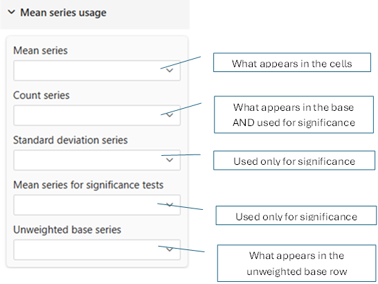
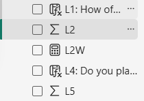
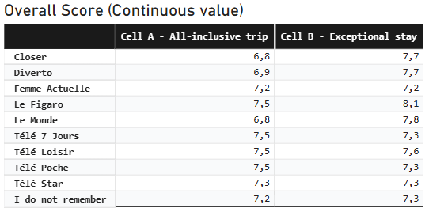
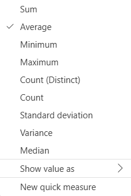
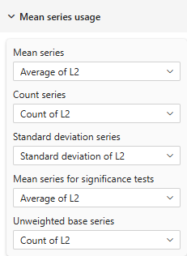
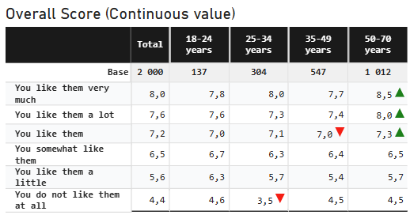
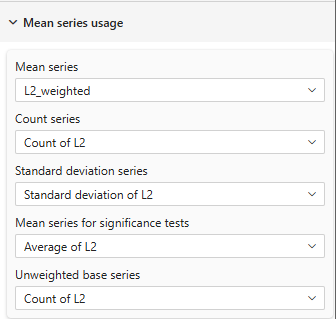
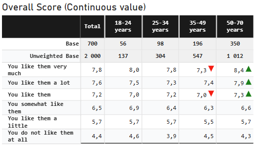
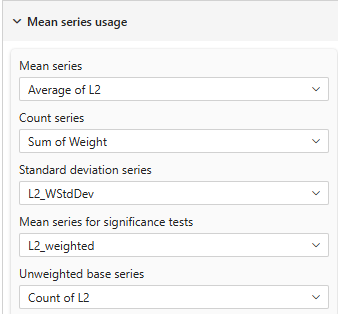
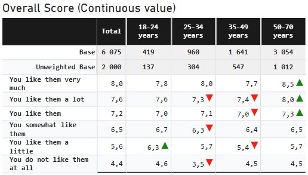

# Mean Series Configuration

## Overview



Configure which data series (measures) are used for mean (average) calculations, statistical properties, and significance testing in mean tables.

:::info Edition Availability
- Mean tables: Available in **Pro** and **Premium** editions
- All series configuration available in both Pro and Premium
:::

---

## Understanding Mean Tables

Mean tables display **average values** rather than percentages or counts. They're used for:

- Customer satisfaction scores
- Performance metrics (ratings, scores, times)
- Financial averages (revenue per customer, average order value)
- Measurement data (temperature, weight, distance)

:::tip
Mean tables are ideal for continuous data where averages and variability matter. Continuous (or numeric) data are indicated within Power Bi with a sigma (Σ) symbol next to the measure name (here under L2 and L5).
<span style={{textAlign: "center"}}>

</span>
:::


**Example Mean Table**:
<span style={{textAlign: "center"}}>

<br/>_Mean table showing average score of customer recognition by media channel and survey cell_
</span>
---

:::warning
The component itself **DOES NOT** calculate means directly. You must provide appropriate measures from your data model for each series (Average, Count, Std Dev, etc.) or a pre-calculated measure for weighted mean. See the **Data Model Requirements** section for details on creating these measures.
:::
## Core Series Configuration

### Mean Series
**Setting**: Mean Series  
**Required**: Yes  
**Type**: Dropdown (lists available measures)

The primary data series containing the values to be averaged.

**What It Contains**:
- Individual measurements or scores
- Pre-calculated means (if aggregated in data model)
- Weighted average (if using weights)

Usually, after having dropped the variable in the 'values' section, you will use the 'Average' function in the dropdown listed measures:<br/>

You can also create custom DAX measures for more complex mean calculations.
**Examples**:

**Example 1: Satisfaction Scores**
```DAX
Mean Series = AVERAGE(Survey[SatisfactionScore])

Data:
- Respondent A: 5
- Respondent B: 4
- Respondent C: 5
Mean = (5 + 4 + 5) / 3 = 4.67
```

**Example 2: Revenue per Customer**
```DAX
Mean Series = DIVIDE(SUM(Sales[Revenue]), DISTINCTCOUNT(Sales[CustomerID]))

Calculates: Average revenue per unique customer
```

**Common Sources**:
- `AVERAGE(Table[Metric])`
- `DIVIDE(SUM(Values), COUNT(Records))`
- Pre-calculated mean field
- Weighted mean calculation

---

### Count Series
**Setting**: Count Series  
**Required**: For displaying sample size  
**Type**: Dropdown (lists available measures)

The number of observations used to calculate show the sample size.

**What It Shows**:
- Sample size (n)
- Number of respondents/records
- Reliability indicator

**Why It Matters**:
```
Product A: Mean = 4.2, Count = 1000  ✅ Reliable 
Product B: Mean = 4.8, Count = 5     ❌ Unreliable

Same difference (0.6), but Product B has tiny sample
```
Usually, you will use the _'Count'_ or _'Count(Distinct)'_ function in the dropdown listed measures:<br/>

You may also create custom DAX measures for specific counting logic.
**Examples**:

**Example 1: Simple Count**
```DAX
Count Series = COUNTROWS(Survey)
Counts: All rows in the table
```

:::warning
using COUNTROWS will count all rows, including one which may NOT take part in the calculation. If your variable contains missing or irrelevant data, use the 'Count Rows' function in the dropdown listed functions.
:::

**Example 2: Respondent Count**
```DAX
Count Series = DISTINCTCOUNT(Survey[RespondentID])

Counts: Unique respondents (not duplicate responses)
```

**Example 3: Non-Missing Values**
```DAX
Count Series = COUNTROWS(FILTER(Survey, NOT(ISBLANK(Survey[Score]))))

Counts: Only records with actual scores
```

**Display in Table**:
```
                Product A   Product B   Product C        
Base              1250         980         45
Average            4.2         4.5        3.9 
                ■ Large sample          ▪ Small sample (less reliable)
```
---

### Standard Deviation Series
**Setting**: Standard Deviation Series  
**Required**: For significance testing and variability analysis  
**Type**: Dropdown (lists available measures)

The measure of variability/spread in the data.
This measure is required for significance testing of mean differences. It is never displayed directly in the table but used in calculations behind the scenes.

## Specific Significance Testing Series

### Significance Mean Series
**Setting**: Significance Mean Series  
**Required**: Only if using significance tests  
**Type**: Dropdown (lists available measures)  
**Available in**: Pro, Premium

There is cases where you may need to provide a different mean series for significance testing than the one used for display, reason why the tool proposes this separate setting.
Set here the mean values used for statistical significance testing.

**When It Differs from Mean Series**:
- Display uses weighted means
- Testing uses unweighted means
- Different aggregation rules for testing

**Common Scenarios**:

**Scenario 1: Same as Mean Series (Most Common)**
```
Mean Series: AVERAGE(Survey[Score])
Significance Mean Series: AVERAGE(Survey[Score])

Use when: Testing and display use same data
```
<table><tr>
<td></td>
<td></td>
</tr>
<tr style={{textAlign: "center"}}>
<td colspan="2">_Mean table showing same mean series for display and significance testing_</td>
</tr></table>


**Scenario 2: Different Series**

:::tip
To Create a weighted mean, use _"New Measure"_ in Power BI and entrer a DAX formula like:
```DAX
L2_weighted = DIVIDE(
    SUMX(main, main[L2] * main[Weight]),   // Note the SUMX to multiply row by row each L2 value by its Weight
    SUM(main[Weight]),
    BLANK() // if divide by Zero
)
```
You will also need to create a weighted standard deviation measure for significance testing.
```DAX
L2_WStdDev = 
VAR MeanValue = [L2_weighted]
RETURN  
    SQRT(
        DIVIDE(
            SUMX(
                main,
                main[Weight] * POWER(main[L2] - MeanValue, 2)
            ),
            SUM(main[Weight])
        )
    )
```

:::
**Example**:
Here under are three different settings
- in the first one the 'Mean Series' is set to a raw mean measure with the 'Significance Mean Series' set the same as count Series.
- in the second one the 'Mean Series' is still set to a raw mean measure with the 'Significance Mean Series' and 'Count Series' set to the Weighted measures. With these settings, significance use the weighted population and the weighted mean for testing while the display use the raw mean so values remains the same while significance tests are based differently.
- in the third one the 'Mean Series' is set to a weighted mean measure with the 'Significance Mean Series' set to a raw mean measure and the 'Count Series' set to the raw count measure. With these settings, significance use the raw population and the raw mean for testing while the display use the weighted mean so values differs between display and testing.
<table><tr>
<td></td>
<td></td>
</tr>
<tr style={{textAlign: "center"}}>
<td colspan="2">_Mean table showing the same mean series for display (unweighted) and significance testing (unweighted)_ </td>
</tr></table>

<br/>
<table><tr>
<td></td>
<td></td>
</tr>
<tr style={{textAlign: "center"}}>
<td colspan="2">_Mean table showing different mean series for display (weighted) and significance testing (unweighted)_ <br/>
_Note the difference in the 'Count series' and 'Mean Series for significance tests'_</td>
</tr></table>
<br/>

<table><tr>
<td></td>
<td></td>
</tr>
<tr style={{textAlign: "center"}}>
<td colspan="2">_Mean table showing different mean series for display (unweighted) and significance testing (weighted)_ <br/>
_Note the difference in the 'Count series' and 'Mean Series for significance tests'_</td>
</tr></table>

**Why Separate?**:
- Research protocols may require unweighted testing
- Different statistical requirements
- Regulatory or methodological standards

---

### Unweighted Base Series
**Setting**: Unweighted Base Series  
**Required**: Only when using weighted data  
**Type**: Dropdown (lists available measures)

The raw count of observations before weighting adjustments. Used for unweighted base row only, no calculation is made with it.

**When to Use**:
- For research transparency
- To show actual sample sizes

---

## Data Model Requirements

### Required Measures for Mean Tables

#### 1. Mean: Either select 'Average' in the dropdown selection of the continuous variable (raw only) or create a Mean Calculation
```DAX
// Simple average
MeanScore = AVERAGE(Survey[Score])

// Or weighted average
WeightedMean = 
VAR FilteredData = FILTER(Survey, NOT(ISBLANK(Survey[Score])))  // Define the Sub-Set of Data where 'Score' is present (not necessary if variable is mandatory)
    DIVIDE(
        SUMX(FilteredData, Survey[Score] * Survey[Weight]),
        SUMX(FilteredData, Survey[Weight]),
        BLANK()
    )
```

#### 2. Count: Either select 'Count' in the dropdown selection (raw), the 'Sum' function of the weight variable or a Size Calculation
```DAX
// Simple count
SampleSize = COUNTROWS(Survey)

// Or unique respondents
RespondentCount = DISTINCTCOUNT(Survey[RespondentID])

// Or non-blank count
ValidResponses = COUNTROWS(FILTER(Survey, NOT(ISBLANK(Survey[Score]))))

// or Weighted count
WeightedCount = SUM(Survey[Weight])
```

:::warning
You **SHOULD NOT** Count another variable (like the record ID or respondent ID) as the Average or Std Deviation are calculated upon non-null values of the selected mean variable.
:::


#### 3. Standard Deviation: Either select 'Standard Deviation' in the dropdown selection of the variable or create a Standard Deviation Calculation
```DAX
// Sample standard deviation
StdDeviation = STDEV.S(Survey[Score])

// Or Weighted standard deviation
WeightedStdDev =
VAR FilteredData = FILTER(Survey, NOT(ISBLANK(Survey[Score])))  // Define the Sub-Set of Data where 'Score' is present

VAR MeanValue = DIVIDE(SUMX(FilteredData, Survey[Score] * Survey[Weight]), SUMX(FilteredData, Survey[Weight]))
RETURN  
    SQRT(
        DIVIDE(
            SUMX(FilteredData,
                Survey[Weight] * POWER(Survey[Score] - MeanValue, 2)
            ),
            SUMX(FilteredData, Survey[Weight])
        )
    )

```

#### 4. Unweighted Base : This shoud ALWAYS be a raw 'count' or 'Count distinct' function of non-null value of selected mean variable
```DAX
UnweightedCount = DISTINCTCOUNT(Survey[Score])
```
:::warning
You **SHOULD NOT** Count another variable (like the record ID or respondent ID) as the Mean or Std Deviation are calculated upon non-null values of the selected mean variable.
:::


---

---

## Practical Examples

### Example 1: Customer Satisfaction Scores
```
Question: "Rate your satisfaction (1-5)"

Configuration:
- Mean Series: "Average Satisfaction Score"
- Count Series: "Count of Respondents"
- StdDev Series: Not shown
```

### Example 2: Performance Analysis with significance
```
Metric: Employee performance ratings

Configuration:
- Mean Series: "Average Rating"
- Count Series: "Employee Count"
- StdDev Series: "Rating Std Dev"
```

### Example 3: Weighted Research Study
```
Survey: National satisfaction study (weighted)

Configuration:
- Mean Series: "Weighted Mean Satisfaction"
- Count Series: "Sum of Weights"
- StdDev Series: "Satisfaction Std Dev"
- Unweighted Base: "Count of Respondents"
- Significance Mean: "Unweighted Mean"
```

### Example 4: Revenue Analysis
```
Metric: Average revenue per customer

Configuration:
- Mean Series: "Revenue per Customer"
- Count Series: "Customer Count"
```
---

## Statistical Context

### When to Use Mean Tables

**Good for**:
- Continuous measurements (temperature, time, money)
- Rating scales (1-5, 1-10)
- Satisfaction scores (NPS, CSAT)
- Performance metrics
- Financial averages

**Not Good for**:
- Categorical data (Yes/No, Male/Female)
- Count data (number of purchases)
- Percentages/proportions
- Binary outcomes

**Use percentage tables instead for**: Frequency distributions, category breakdowns

---

### Sample Size Considerations

**Minimum Sample Sizes**:
- **n < 30**: Means unreliable, use caution
- **n = 30-100**: Acceptable for most purposes
- **n > 100**: Reliable means
- **n > 1000**: Very stable estimates

**Impact on Significance**:
- Large samples detect small differences
- Small samples miss real differences
- Always consider practical significance

---

## Troubleshooting

### Q: Mean values look incorrect
**A**: 
- Verify Mean Series calculation in a simple visual first
- Check for filter context issues in DAX
- Ensure measure aggregates correctly across dimensions

### Q: Count doesn't match expectations
**A**:
- Check if counting rows vs distinct IDs
- Verify weighted vs unweighted count
- Look for filter context in measure definition

### Q: Standard deviation shows as blank
**A**:
- Ensure StdDev Series is mapped
- Check that measure returns values
- Verify sufficient data points (need n ≥ 2)

### Q: Unweighted base same as count
**A**: Your data likely isn't weighted; you can hide unweighted row

### Q: Mean tables not available
**A**: Mean tables require Pro or Premium edition

### Q: Significance tests don't work with means
**A**:
- Verify all three series: Mean, Count, StdDev
- Check Significance Mean Series is configured
- Ensure adequate sample sizes (n ≥ 30 recommended)

---

## Best Practices

1. **Always Show Count**: Sample size is critical for interpreting means
2. **Consider StdDev**: Helps understand data consistency
3. **Test Measures First**: Validate in simple visuals before using in cross-tab
4. **Document Calculations**: Note whether means are weighted/unweighted
5. **Check for Outliers**: Extreme values can skew means
6. **Minimum Samples**: Use thresholds to mask small sample means
7. **Weighted Data**: Always show both weighted and unweighted counts
8. **Practical Significance**: A statistically significant 0.1 difference may not matter

---

## Related Settings

- [Table Contents](table-content.md) — Set table type to "Mean"
- [Percentage Series](percentage-series.md) — For percentage table configuration
- [Significance Testing](significance.md) — Configure t-tests for means
- [Thresholds](thresholds.md) — Mask means with small samples
- [Totals & Subtotals](totals.md) — How counts display

---

For more help, see the [Quick Start Guide](../02-getting-started/quick-start.md) or contact support.
