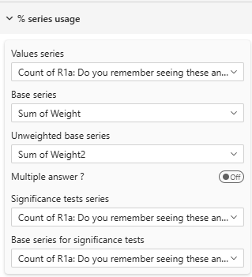

# Percentage Series Configuration



## Overview

Configure which data series (measures) are used for different calculations in percentage tables. Proper series mapping is essential for accurate percentages, bases, and significance testing.

---

## Understanding Series

In Power BI, a **series** is a measure or calculated field that contains numerical data. For percentage tables, you need to map different series to different purposes:

- **Value Series**: The numerator (what you're counting)
- **Base Series**: The denominator (what you're dividing by)
- **Additional Series**: For significance testing and unweighted bases

---

## Core Series Configuration

### Value Series
**Setting**: Value Series  
**Required**: Yes  
**Type**: Dropdown (lists available measures)

The primary data series used to populate cell values.

**What It Contains**:
- For single response: Count of respondents selecting each option
- For multiple response: Count of respondents mentioning each item
- For weighted data: Weighted counts

**Example**:
```
If measuring product preference:
Value Series = "Count of Respondents"
or
Value Series = "Sum(WeightedResponses)"
```

**Common Sources**:
- `COUNT(ResponseID)`
- `SUM(Weight)`
- `COUNTROWS(Responses)`
- Pre-calculated measure from your data model

---

### Base Series
**Setting**: Base Series  
**Required**: For accurate percentages  
**Type**: Dropdown (lists available measures)

The denominator used to calculate percentages.

**What It Contains**:
- Total count of respondents in each column
- Total population for the segment
- Weighted base (if using weights)

**Calculation**:
```
Percentage = (Value Series / Base Series) × 100
```

**Example**:
```
Column: Male Respondents
Value Series: 150 (males who chose Product A)
Base Series: 300 (total males)
Result: 150 / 300 = 50%
```

**Common Sources**:
- `COUNT(DISTINCT RespondentID)`
- `SUM(Weight)` (for weighted base)
- Pre-calculated base measure

**Important**: Base Series should match the scope of your analysis:
- For column percentages: Base = column total
- For row percentages: Base = row total
- For total percentages: Base = grand total

---

### Unweighted Base Series
**Setting**: Unweighted Base Series  
**Required**: Only if using weighted data  
**Type**: Dropdown (lists available measures)

The raw count of respondents/records before any weighting adjustments.

**When to Use**:
- Your data is weighted (demographics, quotas, etc.)
- You need to show actual sample sizes
- For research transparency

**What It Shows**:
```
                Total    North    South
Weighted Base   1000     400      600
Unweighted      950      350      600  ← This row
```

**Example**:
```
Unweighted Base Series = "COUNT(DISTINCT RespondentID)"
(Counts actual people, ignoring weights)
```

**Why It Matters**:
- Shows actual sample size (reliability indicator)
- Required for professional research reporting
- Helps readers understand data confidence

---

## Response Mode Configuration

### Multiple Answer Mode
**Setting**: Multiple answer?  
**Type**: Toggle  
**Default**: Off

Controls how percentages are calculated for questions allowing multiple selections.

#### Single Response Mode (Toggle Off)
Used when respondents select **one option only**.

**Characteristics**:
- Column percentages sum to 100%
- Each respondent counted once per column
- Standard cross-tabulation

**Example**:
```
Question: "Which ONE product do you prefer?"

              Total    Male     Female
Base          1000     480      520
Product A     45%      42%      48%
Product B     35%      38%      32%
Product C     20%      20%      20%
Total         100%     100%     100%  ← Sums to 100%
```

#### Multiple Response Mode (Toggle On)
Used when respondents can select **multiple options**.

**Characteristics**:
- Column percentages may exceed 100%
- Each respondent can be counted multiple times
- Base = total respondents (not total mentions)

**Example**:
```
Question: "Which products do you use? (Select all)"

              Total    Male     Female
Base          1000     480      520
Product A     65%      60%      70%
Product B     45%      50%      40%
Product C     30%      35%      25%
Total         140%     145%     135%  ← Can exceed 100%
```

**Calculation in Multiple Mode**:
```
Percentage = (Count of respondents mentioning item / Total respondents) × 100
```

**When to Use**:
- "Select all that apply" questions
- Multiple choice questions
- Attribute tracking (features, behaviors, etc.)

---

## Significance Testing Series

These series are used when performing statistical significance tests.

### Significance Series
**Setting**: Significance Series  
**Required**: Only if using significance tests  
**Type**: Dropdown (lists available measures)  

The data series used for calculating significance tests.

**What It Should Contain**:
- Same type of data as Value Series
- May be identical to Value Series
- Could be different if testing on different data

**Common Scenarios**:

**Scenario 1: Same as Value Series**
```
Value Series: "Sum(WeightedResponses)"
Significance Series: "Sum(WeightedResponses)"

Use when: Testing on the same weighted data you're displaying
```

**Scenario 2: Different Series**
```
Value Series: "Sum(WeightedResponses)" (for display)
Significance Series: "Count(Responses)" (for testing)

Use when: Display weighted but test unweighted
```

**Why Separate?**:
- Research methodologies may require testing on unweighted data
- Display and testing may use different rules
- Specialized weighting scenarios

---

### Base Significance Series
**Setting**: Significance Base Series  
**Required**: Only if using significance tests  
**Type**: Dropdown (lists available measures)  

The base used for calculating proportions in significance tests.

**What It Should Contain**:
- Denominator for significance calculations
- May match Base Series or be different
- Must align with Significance Series

**Example**:
```
Testing whether males differ from females on Product A preference:

Significance Series: Count(Males choosing A) = 150
Base Signif Series: Count(All Males) = 300
Proportion: 150/300 = 0.50

Compare to:
Significance Series: Count(Females choosing A) = 180
Base Signif Series: Count(All Females) = 400
Proportion: 180/400 = 0.45

Test: Is 0.50 significantly different from 0.45?
```

**Common Configuration**:
```
If using weighted data for display but unweighted for testing:

Base Series: "Sum(Weight)" (denominator for display %)
Base Signif Series: "COUNT(RespondentID)" (denominator for testing)
```

---

## Series Mapping Strategy

### Strategy 1: Simple Unweighted Data
**Best for**: Internal analysis, no weighting needed

```
Value Series: COUNT(Responses)
Base Series: COUNT(DISTINCT RespondentID)
Multiple Answer: As appropriate
Significance Series: (same as Value)
Base Signif Series: (same as Base)
```

### Strategy 2: Weighted Data (Display Only)
**Best for**: Weighted reporting without statistical tests

```
Value Series: SUM(Weight)
Base Series: SUM(Weight)
Unweighted Base Series: COUNT(DISTINCT RespondentID)
Multiple Answer: As appropriate
```

### Strategy 3: Weighted Data with Testing
**Best for**: Professional research with significance tests

```
Value Series: SUM(WeightedResponse)
Base Series: SUM(Weight)
Unweighted Base Series: COUNT(DISTINCT RespondentID)
Significance Series: COUNT(Response)
Base Signif Series: COUNT(DISTINCT RespondentID)
Multiple Answer: As appropriate
```

### Strategy 4: Complex Weighting
**Best for**: Multiple weighting schemes, advanced research

```
Value Series: SUM(DisplayWeight)
Base Series: SUM(DisplayWeight)
Unweighted Base Series: COUNT(DISTINCT RespondentID)
Significance Series: SUM(TestWeight)
Base Signif Series: SUM(TestWeight)
```

---

## Practical Examples

### Example 1: Basic Survey (Unweighted)
```
Question: "How satisfied are you?" (Single choice)

Configuration:
- Value Series: "Count of Responses"
- Base Series: "Count of Respondents"
- Multiple Answer: No
- Significance: Not used

Result:
              Total    North    South
Base          1000     400      600
Very Sat      35%      40%      32%
Satisfied     45%      43%      47%
Neutral       15%      12%      17%
Unsatisfied   5%       5%       4%
```

### Example 2: Weighted Research Study
```
Question: "Which brands do you recognize?" (Multiple)

Configuration:
- Value Series: "Sum(Weighted Recognition)"
- Base Series: "Sum(Weight)"
- Unweighted Base Series: "Count of Respondents"
- Multiple Answer: Yes
- Significance Series: "Count(Recognition)"
- Base Signif Series: "Count of Respondents"

Result:
                Total    Urban    Rural
Weighted Base   1000     650      350
Unweighted      1000     520      480
Brand A         68%      75%      55%
Brand B         45%      52%      32%
Brand C         30%      35%      20%
Total           143%     162%     107%  ← Multiple response
```

### Example 3: Product Usage Tracking
```
Question: "Which features do you use?" (Select all)

Configuration:
- Value Series: "Count of Feature Mentions"
- Base Series: "Count of Users"
- Multiple Answer: Yes

Result:
              Total    Pro      Basic
Base          5000     2000     3000
Feature A     65%      85%      52%
Feature B     45%      70%      30%
Feature C     30%      55%      15%
Feature D     20%      40%      8%
```

---

## Data Model Requirements

### Required Measures

For proper percentage tables, ensure your data model includes:

#### 1. Value Measure
```DAX
Value = COUNTROWS(Responses)
or
WeightedValue = SUM(Responses[Weight])
```

#### 2. Base Measure
```DAX
Base = DISTINCTCOUNT(Responses[RespondentID])
or
WeightedBase = CALCULATE(SUM(Responses[Weight]), ALL(Responses[Response]))
```

#### 3. Unweighted Base (if needed)
```DAX
UnweightedBase = DISTINCTCOUNT(Responses[RespondentID])
```

#### 4. Significance Measures (if testing)
```DAX
SignifValue = COUNTROWS(Responses)
SignifBase = DISTINCTCOUNT(Responses[RespondentID])
```

---

## Common Patterns

### Pattern 1: Standard Survey Cross-Tab
```
Single choice question
No weighting
No significance testing

→ Value Series: Response count
→ Base Series: Respondent count
→ Multiple Answer: No
```

### Pattern 2: Multiple Response Analysis
```
"Select all that apply" question
No weighting
No significance testing

→ Value Series: Mention count
→ Base Series: Respondent count
→ Multiple Answer: Yes
```

### Pattern 3: Weighted Research
```
Weighted to population
Show both weighted and unweighted
No significance testing

→ Value Series: Weighted count
→ Base Series: Weighted base
→ Unweighted Base Series: Raw count
→ Multiple Answer: As appropriate
```

### Pattern 4: Full Statistical Analysis
```
Weighted display
Unweighted testing
Statistical significance

→ Value Series: Weighted count
→ Base Series: Weighted base
→ Unweighted Base Series: Raw count
→ Significance Series: Unweighted count
→ Base Signif Series: Unweighted base
→ Multiple Answer: As appropriate
```

---

## Troubleshooting

### Q: Percentages don't add to 100%
**A**: Check your configuration:
- Single response: Verify Base Series matches column scope
- Multiple response: This is normal; ensure "Multiple Answer" is ON

### Q: Percentages look wrong (too high/low)
**A**: 
- Verify Value Series and Base Series are properly matched
- Check Base Series is at correct grain (respondent level, not response level)
- For weighted data, ensure both use same weight field

### Q: Unweighted base is identical to weighted base
**A**: Your data likely isn't weighted; you can hide the unweighted row

### Q: Base values don't match expectations
**A**:
- Check your measure definitions
- Verify filter context in DAX
- Ensure DISTINCTCOUNT on respondent ID, not response count

### Q: Significance tests don't work
**A**:
- Verify Significance Series and Base Signif Series are mapped
- Check that measures return values
- Ensure series contain appropriate data for testing

### Q: Can I use the same series for multiple purposes?
**A**: Yes, especially for simple unweighted data. Just select the same measure for Value/Base/Significance as appropriate.

---

## Best Practices

1. **Match Series Properly**: Value and Base must use same weighting
2. **Test Your Measures**: Verify measures in a matrix visual first
3. **Document Your Setup**: Note which series maps to what in your model
4. **Consistent Naming**: Use clear measure names (e.g., "Weighted_Value", "Unweighted_Base")
5. **Validate Results**: Check a few cells manually to ensure correct calculation
6. **Multiple Response**: Always verify "Multiple Answer" setting matches question type
7. **Significance Setup**: Test significance configuration on simple data first

---

## Related Settings

- [Table Contents](table-content.md) — Overall table type and display
- [Totals & Subtotals](totals.md) — How bases display in table
- [Significance Testing](significance.md) — Configure statistical tests
- [Mean Series](mean-series.md) — For mean table configuration

---

For more help, see the [Quick Start Guide](../02-getting-started/quick-start.md) or contact support.
