# Ranking Settings Reference

## Overview

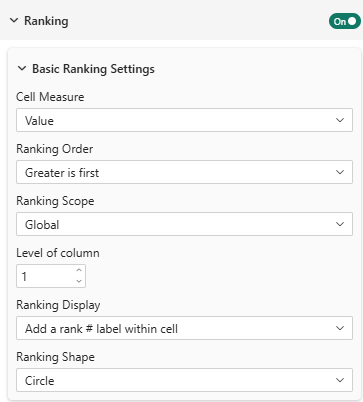

Automatically rank cells within each column and visualize rankings with numbers, colors, or gradients.

:::info[Edition Availability]
Ranking is available in **Pro** and **Premium** editions.
:::

---

## Enable Ranking

### Do Ranking
**Setting**: Do ranking  
**Type**: Toggle  
**Default**: Off  
**Available in**: Pro, Premium

Turns ranking on/off for all cells in the table.

---

## Ranking Configuration

### Cell Value Property
**Setting**: Cell value  
**Type**: Dropdown  
**Options**: Value, Horizontal Percentage, Indice  
**Default**: Value

Which metric to rank by within each column.
:::info
the metric used for ranking **DOES NOT** need to be displayed in the table. You can rank on one metric while displaying another.
:::

:::tip
It is an interesting feature to sort on a specific measure but to rank on another measure like 'Sorting my metric vertical percentage but rank on indice'.
:::

:::note
Because Vertical Percentage is calculated based on column totals, ranking by **Value** and **Vertical Percentage** yield exactly the same order. Therefore, only 'Value', 'Horizontal Percentage', and 'Indice' options are shown.
:::

### Ranking Order
**Setting**: Ranking order  
**Options**: Greater is first, Lesser is first  
**Default**: Greater is first

Determines what's considered "best" (rank #1).

- **Greater is first**: Highest values get rank 1 (sales, satisfaction, etc.)
- **Lesser is first**: Lowest values get rank 1 (costs, errors, etc.)

---
### Ranking Scope
**Setting**: Ranking scope  
**Options**: Global, Per Column, Per Row
**Default**: Global

Determines how-to rank the cells.
- **Global**: Ranks all cells in the table together
- **Per Column**: Ranks cells within each column separately
- **Per Row**: Ranks cells within each row separately

Examples: **Ranking per column**:
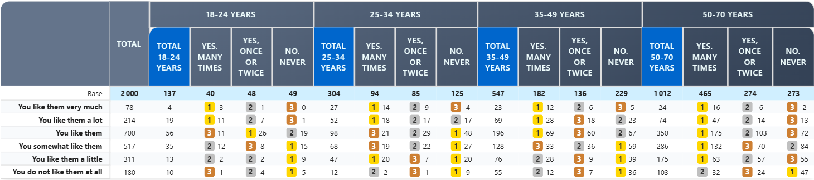

See **level of column** setting below to choose which column level to consider for Global and Per Row ranking.

### Level of Column for Global and per-row ranking
**Setting**: Level of column
**Options**: From 0 to N (N = number of column levels - 1)      
**Default**: 1

When using "Global" or "Per Row" ranking scope, choose which column level to consider for ranking.
- **Level 0**: Total of all columns (global or per-row)
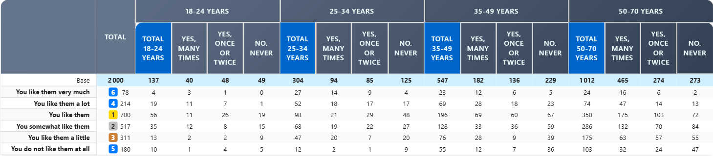
- **Level 1**: First level of columns - global
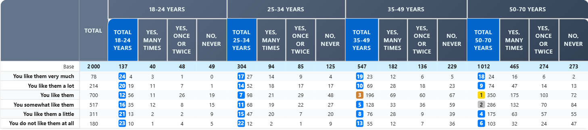
- **Level 1**: First level of columns - per row
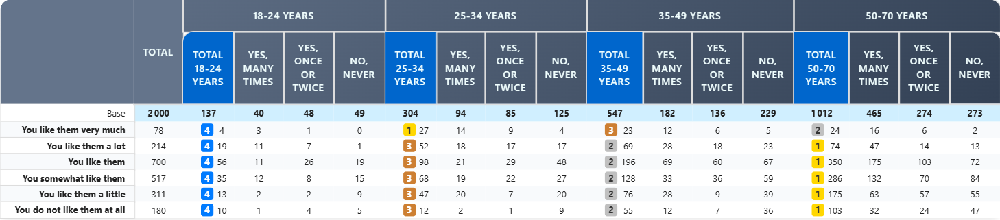
- **Level N**: Nth level of columns - global
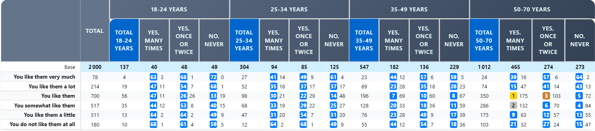
- **Level N**: Nth level of columns - per row
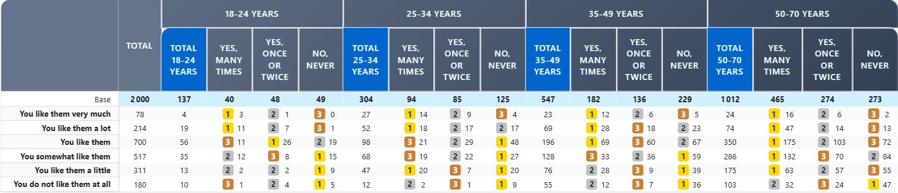


---

## Ranking Display Options

### Display Format
**Setting**: Ranking display  
**Options**: 
- Add a rank # label within cell
- Color from Red to Blue
- Color from Red to Green
- Custom color gradient  
**Default**: Add a rank # label

#### Rank Label
Shows a numbered badge (1, 2, 3...) in cells. Choose the shape:

**Shape Options**:
- **Circle**: Round badge
- **Square**: Square badge
- **Rounded Square**: Square with rounded corners

**Example**:

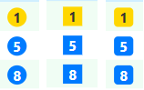

#### Color Gradients

**Red to Blue**:

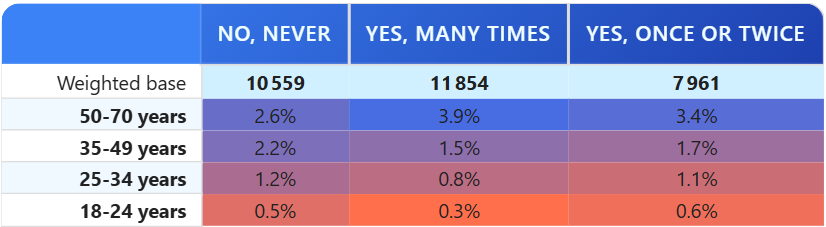
- Red = lowest rank
- Blue = highest rank
- Good for neutral comparisons

**Red to Green**:

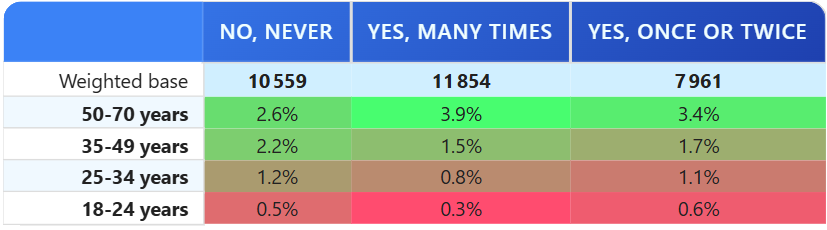
- Red = low/bad
- Green = high/good
- Commonly understood for positive/negative

**Custom Color Gradient**:
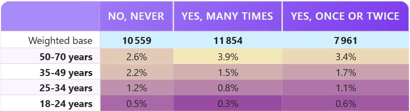
- Define your own start and end colors
- Full control over color scheme

---

## Color-Based Ranking Settings

When using color display, configure these additional options:

### Color Strength
**Setting**: Color strength  
**Type**: Slider (1-10)  
**Default**: 7

Controls how saturated/intense the ranking colors are.

- **1-3**: Subtle colors, barely noticeable
- **4-7**: Standard intensity
- **8-10**: Bold, highly visible colors

### Use Value for Color
**Setting**: Use value for color  
**Type**: Toggle  
**Default**: Off

Normally, colors are based on rank position (rank 1, 2, 3...). Enable this to base colors on actual cell values instead.

**Example**:
```
Without this option:
- Rank 1 (value 95%) = Dark green
- Rank 2 (value 94%) = Light green
- Rank 3 (value 50%) = Light red  ← Same color!

With this option:
- Value 95% = Dark green
- Value 94% = Light green
- Value 50% = Dark red  ← Different color
```
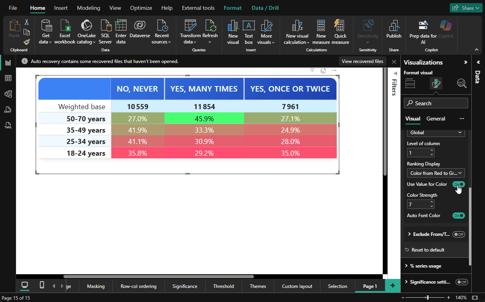

### Auto Font Color
**Setting**: Auto font color  
**Type**: Toggle  
**Default**: Off

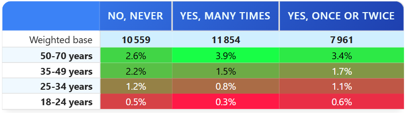

Automatically adjust text color (black/white) based on background color for better readability.

**Useful for**: Color-based gradients to ensure text is always readable

---

## Exclude Middle Range (Advanced)

Exclude certain values from being colored/ranked, useful for "neutral" zones.

### Prevent Middle Range from Coloring
**Setting**: Prevent middle range from coloring  
**Type**: Toggle  
**Default**: Off  
**Available in**: Premium

When enabled, values between two thresholds are left uncolored.

### Exclude Range
When "Prevent middle range" is enabled:

**Exclude From** (Start value)  
**Exclude To** (End value)

Values in this range remain neutral (no color or styling).

**Example**:

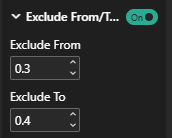
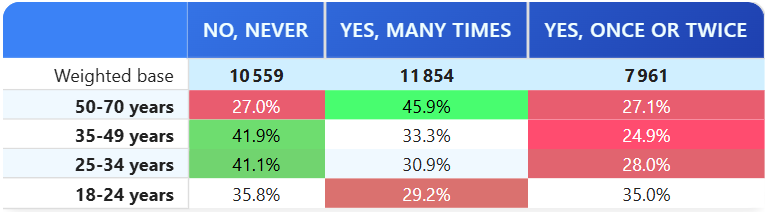

---

## Custom Color Gradient

Available in **Premium** edition with "Custom color gradient" display option.

### Color From
**Type**: Color picker  
**Default**: White

The color for lowest-ranked values.

### Color To
**Type**: Color picker  
**Default**: Black

The color for highest-ranked values.

---

## Practical Examples

### Example 1: Sales Performance (Pro Edition)
```
Configuration:
- Enable Ranking: Yes
- Ranking Order: Greater is first
- Display Format: Color from Red to Green
- Color Strength: 8

Result: Top-selling regions show in green,
        lower performers in red within each column
```

### Example 2: Cost Analysis
```
Configuration:
- Enable Ranking: Yes
- Ranking Order: Lesser is first (lower costs = better)
- Display Format: Add rank # label
- Shape: Circle

Result: Cost leaders show as [1], [2], [3]
        within each category
```

### Example 3: Satisfaction with Neutral Zone
```
Configuration:
- Enable Ranking: Yes
- Display Format: Color from Red to Green
- Prevent middle range: Yes
- Exclude from: 45
- Exclude to: 55

Result: Scores below 45% = red (poor)
        45-55% = neutral (no color)
        Above 55% = green (good)
```

### Example 4: Custom Brand Colors (Premium)
```
Configuration:
- Enable Ranking: Yes
- Display Format: Custom color gradient
- Color From: #FF9999 (light brand red)
- Color To: #99FF99 (light brand green)

Result: Table ranks with custom brand colors
```

---

## Best Practices

1. **Choose Appropriate Order**: "Greater is first" for positive metrics, "Lesser is first" for costs/errors
2. **Keep It Simple**: Use ranks OR colors, not both simultaneously
3. **Color Strength**: Use 7-8 for reports, 5-6 for dense data tables
4. **Font Color**: Enable auto font color with strong gradients
5. **Neutral Zones**: Use exclude range for naturally neutral metrics (satisfaction 40-60% might be "neutral")
6. **Test Accessibility**: Ensure colors are distinguishable for color-blind readers

---

## Troubleshooting

**Q: Rankings show but colors aren't appearing**  
A: Check that you've selected a color display option (not "rank label")

**Q: Color gradient goes the wrong direction**  
A: Verify "Ranking Order" matches your expectations (Greater/Lesser)

**Q: Rank numbers are hard to read**  
A: Enable "Auto Font Color" or adjust colors in formatting

**Q: Values seem to rank incorrectly**  
A: Check that "Cell value" property matches your intention (Value, %, Indice)

For more help, see the [Quick Start Guide](../02-getting-started/quick-start.md).
