# Significance Testing Reference

## Overview

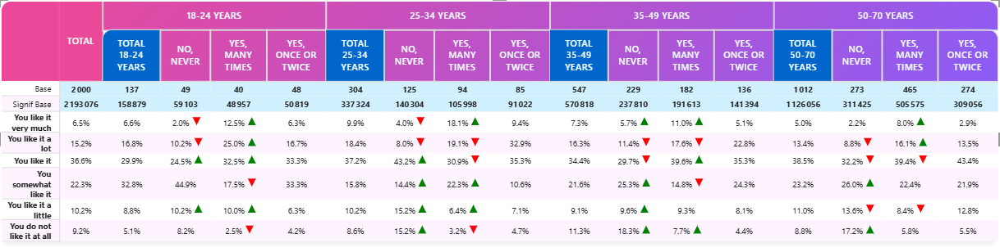

The Socio Data Management Power BI cross table tool lets you identify statistically significant differences between groups in your data in several manner, depending on your edition (Pro or Premium) and configuration.
All feattures includes:
- Two independent significance tests per table
- Multiple test types (All columns, Item vs other, Item vs total, Regex)
- Various display options (icon, font color, background color, border color)
- Configurable confidence levels (90%, 95%, 99%)
- Configurable variance methods for percentage tables (pooled, separate)

:::info Edition Availability
- **Basic significance**: Available in **Pro** edition
- **Advanced significance**: Available in **Premium** edition
:::

---

## Test Configuration

### Significance Test 1
**Setting**: Significance 1  
**Options**: None, All columns, Item vs other question item, Item versus Total (Base), Regular expression  
**Default**: None

### Significance Test 2
**Setting**: Significance 2  
**Options**: Same as above  
**Default**: None

Each test compares different aspects of your data.

---

## Test Types Explained

### None
No significance testing is performed.

### All Columns
Compares each column against all others in the table.

:::note You are limited to 156 unique symbols for marking significance. Here is a list of the 156 symbols:
`ABCDEFGHIJKLMNOPQRSTUVWXYZabcdefghijklmnopqrstuvwxyzαβγδεζηθικλμνξοπρστυφχψωΓΔΘΛΞΠΣΦΨΩ🅰🅱🅲🅳🅴🅵🅶🅷🅸🅹🅺🅻🅼🅽🅾🅿🆀🆁🆂🆃🆄🆅🆆🆇🆈🆉ⓐⓑⓒⓓⓔⓕⓖⓗⓘⓙⓚⓛⓜⓝⓞⓟⓠⓡⓢⓣⓤⓥⓦⓧⓨⓩ`
:::

**Use Case**: Determine which regions have significantly different satisfaction scores

**Example**:
<table><tr>
<td>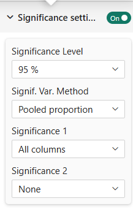</td>
<td>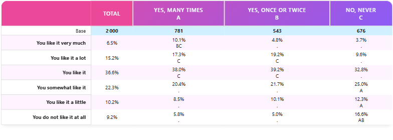</td>
</tr></table>
Note that when you have more than one level of column, the significance markers will appear differently per level to avoid confusion.
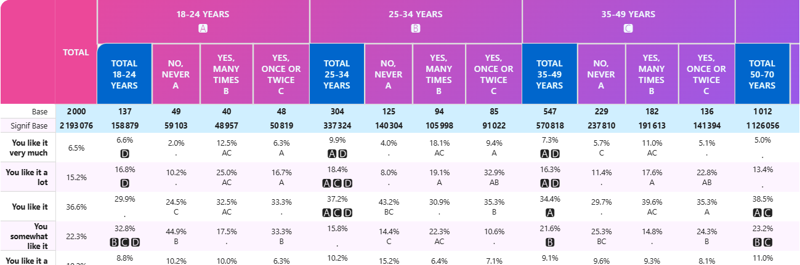

Available in **Pro** and **Premium** editions.

### Item vs Other Question Item
Compares one response option against all others.
:::important
This test is the most used for survey data analysis. You should always prefer this test vs _'Against Total'_ when comparing response options.
:::

**Use Case**: Highlight if one product preference is significantly different

**Example**:

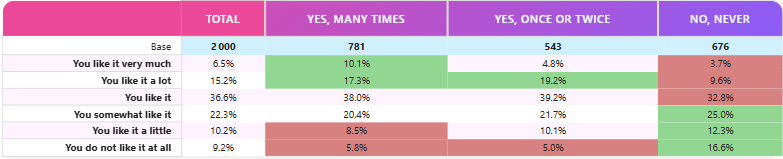

Available in **Pro** and **Premium** editions.

### Item versus Total (Base)
Compares each item to the overall average at the same level.
:::warning
This test has been implemented for legacy purpose and is not generally recommended for any analysis. The reason is that observation (population) of the tested values should _**always be independent**_. In this test the observations of each cell is included in the total so it does not ensure this independency rule.
Unless you have a **good** reason, prefer the _'Item vs Other Question Item'_ test instead.
:::

Available in **Pro** and **Premium** editions.

### Regular Expression
Uses a regex pattern to identify columns to compare.

This option is extremely useful when you are focusing on a brand, a population or a product and want to know which _"competitors"_ are significantly lower or higher.

**Example 1**: _You want to compare the age group "50-70 years" against all other age groups in a satisfaction survey._

In this example, we have two levels of columns but the regex matches only one item on the first level (50-70):
<table><tr>
<td>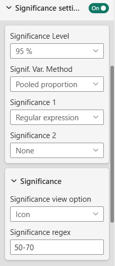</td>
<td>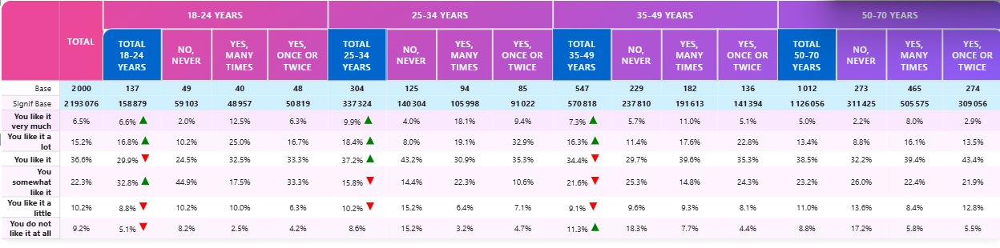</td>
</tr></table>

_The regex pattern used here is `50-70` which matches partially the column with label "50-70 years"._

**Example 2**: _You want to compare respondents who answered "yes, once or twice" against all other response options in a survey question split by age groups._

In this second example, we match on level two, "yes, once" ich matches columns "Yes, once or twice" under each age group:
In this case, only every columns compares to this matched column in each subgroup:
<table><tr>
<td>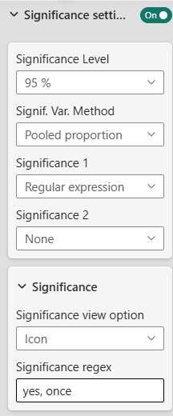</td>
<td></td>
</tr></table>

Available in **Premium** edition only.

---

## Confidence Level

### Significance Level
**Setting**: Significance level  
**Options**: 90%, 95%, 99%  
**Default**: 95%

The confidence threshold for determining significance.

- **90%**: More lenient (flags more differences)
- **95%**: Standard business level
- **99%**: Strict scientific standard

:::info
You usually do not change this settings.
Choose a higher level _(99%)_ for critical decisions.
:::

### Variance Method (Percentage Tables Only)

**Setting**: Signif. Var. Method  
**Options**: Pooled proportion, Separate proportion  
**Default**: Pooled  
**Available in**: Pro, Premium

How variance is calculated when comparing percentages.

- **Pooled**: Treats all groups as one population (more conservative)
- **Separate**: Treats groups separately (more sensitive to differences)

:::tip
In usual situation, leave the default to **Pooled proportion**. 
Choose **Separate proportion** option when group sizes differ greatly.
:::
---

## Display Options

### View Option
**Setting**: Significance view option  
**Options**: Icon, Font Color, Background Color, Cell border Color  
**Default**: Icon

How significant values are marked:

**Icon**: Small symbol/marker appears in cell (Red for significantly lower, Green for significantly higher)
<table><tr>
<td>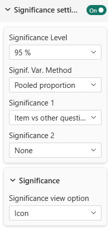</td>
<td>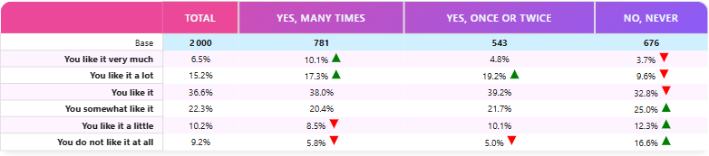</td>
</tr></table>

**Font Color**: Text color changes red or green to highlight significance
<table><tr>
<td>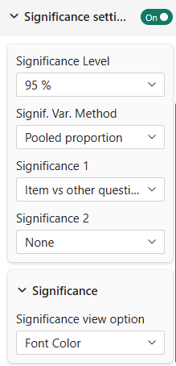</td>
<td>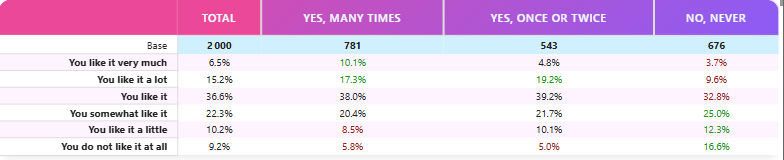</td>
</tr></table>

**Background Color**: Cell background changes red or green to highlight significance
<table><tr>
<td>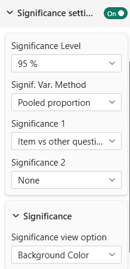</td>
<td></td>
</tr></table>
**Border Color**: Cell border changes red or green to highlight significance
<table><tr>
<td>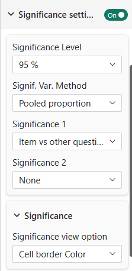</td>
<td>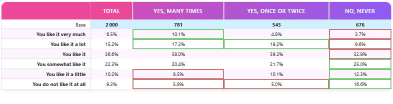</td>
</tr></table>

---

## Advanced Testing (Premium Only)

### Multiple Test Configuration

In Premium edition, you can configure each test independently:
- Different display methods for each test
- Different test types simultaneously
- Regex patterns for flexible comparison

<table><tr>
<td>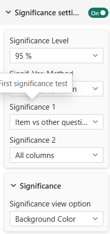</td>
<td>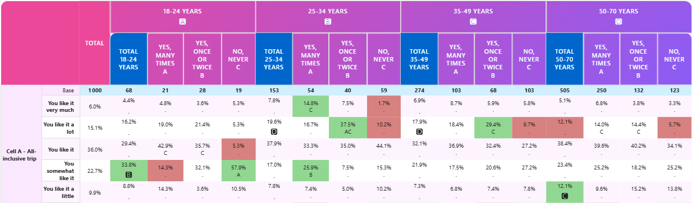</td>
</tr></table>

### Hide First Variable
Hides the first variable in comparative displays for cleaner visuals (see masking in [table-content](table-content.md#masking)).

---

## Statistical Background (For Reference)

### What Tests Are Used?

For percentage tables: **Chi-square test** of independence  
For mean tables: **T-tests** or **ANOVA** (depending on number of groups)

### Interpretation

A cell marked as significant means:
- The difference between groups is unlikely due to chance
- At the chosen confidence level
- Given the sample sizes

### Important Notes

- Significance depends on sample size (large samples show more differences)
- Practical significance ≠ statistical significance (a 1% difference might be statistically significant but not practically important)
- Always consider context, not just statistics

---

## Series Configuration for Testing

Significance tests require special data series:

### For Percentage Tables:
- **Significance Series**: The counts/values used for testing
- **Base Series**: The total base for calculating proportions

### For Mean Tables:
- **Mean Series**: The mean values to test
- **Standard Deviation Series**: Measure of variability
- **Count Series**: Sample size

Configure these in data settings under:
- "Significance Series" (percentage tables)
- "Mean Series for Significance" (mean tables)

---

## Best Practices

1. **Choose Appropriate Test**: Match test type to your question (all columns vs vs-total)
2. **Clear Display**: Use one view option per test for clarity
3. **Document Level**: Note which significance level you're using in reports
4. **Consider Sample Size**: Small sample sizes can miss real differences
5. **Practical Significance**: Don't rely solely on statistics; consider business context

---

## Troubleshooting

**Q: Significance markers don't appear**  
A: Ensure you've configured significance series in data settings

**Q: All cells are marked significant**  
A: Your significance level might be too lenient (90%); try 99%

**Q: No cells marked significant**  
A: Check sample sizes; very small groups won't show significance

**Q: Significance test types are grayed out**  
A: Significance testing requires Pro or Premium edition

For more help, see the [Quick Start Guide](../02-getting-started/quick-start.md) or contact support.
