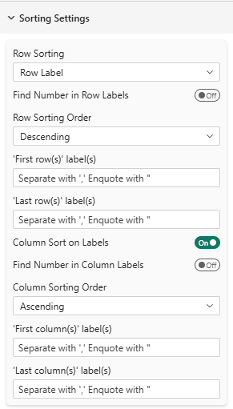
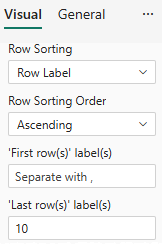

# Sorting & Ordering Reference

## Overview



Customize how rows and columns are arranged in your table with flexible sorting options.

---

## Row Sorting

### Sort Method
**Setting**: Row sorting  
**Options**: None, Row Label (Alphabetical), Column Value  
**Default**: None

When different from 'None', rows are sorted depending on the different settings. Otherwise, rows remain in the order they come from the data source.
See [About sorting elements in Power BI](#about-sorting-elements-in-power-bi) section for more details.

#### None
Rows appear in the order they come from the data source.

#### Row Label (Alphabetical)
Sorts rows alphabetically by their label.

**Example**:
```
Before: North, South, East, West
After:  East, North, South, West
```

:::caution
If you use this setting for numeric labels like "1", "2", "3", the **'10'** label will be considered as coming before "**2"** in alphabetical order (1,10,2,3,4...). In such cases, consider using 'Last Row/Column Positioning' to fix specific label ("10") at the end or use the new "find number in row labels" feature.


:::


#### Column Value
Sorts rows based on values from a specific column you select.

**Use Cases**:
- Sort products by highest sales
- Rank regions by satisfaction score
- Order responses by frequency

---

### Find number in Row Labels 🧪 
**Setting**: Find number in Row Labels  
**Options**: True, False 
**Default**: False

When enabled, this setting extracts numeric values from row labels for sorting purposes. This is particularly useful when your row labels contain numbers mixed with text.

**Example**:
| Text sorting | Find in number sorting |
|-----------------|-----------------|
|Brand A (2024)|	Brand A (**2024**)
|Brand A (2025)|	Brand B (**2024**)
|Brand B (2024)|	Brand C (**2024**)
|Brand B (2025)|	Brand A (**2025**)
|Brand C (2024)|	Brand B (**2025**)
|Brand C (2025)|	Brand C (**2025**)

**Example with purely numeric labels**:
|Text sorting  |Find in number sorting|
|-----------------|-----------------|
|1  |1
|**10** |2
|2  |3
|3  |4
|... |...|
|9  |**10**|

**Example with ranges in labels**:
|Text sorting  |Find in number sorting|
|-----|-----------------|
|none   | from 1 to 50
|beyond 100 | from 50 to 100
| from 1 to 50 | beyond 100
| from 50 to 100 | none

:::tip
This setting is particularly useful for sorting labels that include years, ages, or other numeric indicators within text. Only the **first number** found in the label is considered for sorting.<br/>
If the number is prefixed with a minus sign (e.g., "-5"), it will be treated as a **negative** number.
:::


## Sort Direction

### Sorting Order
**Setting**: Row sorting order  
**Options**: Ascending, Descending  
**Default**: Ascending

Controls whether sorted values go low-to-high or high-to-low.

**Example (Column Value sorting)**:
- **Ascending**: Smallest values first (1, 2, 3...)
- **Descending**: Largest values first (...100, 99, 98)

**Example (Raw label sorting)**:
- **Ascending**: Alphabetical order (A, B, C...)
- **Descending**: Reverse alphabetical order (Z, Y, X...)

---

## Sort Properties

### Column Property
**Setting**: Column property  
**Options**: Value, Horizontal Percentage, Indice  
**Default**: Value

When using "Column Value" sort, choose which metric to sort by.

- **Value**: Value of cells (AND Vertical Percentage)
- **Horizontal Percentage**: Percentage within row
- **Indice**: Index value

:::tip
For percentage tables, sorting by **"Value"** and **"Vertical Percentage"** yield exactly the same order, reason why only 'value',  'horizontal percentage' and 'Indice' options are shown.
:::

---

## Fixed Row/Column Positioning

Force certain rows or columns to stay at the beginning or end, regardless of sort order.

:::info
In the folowing settings, multiple labels can be specified separated by commas. The comparison is not case sensitive and enclose labels in double quotes if they contain comma.
e.g., `My Brand, My First Competitor` or `"Not Answered","no, never"`
:::

### First Rows
**Setting**: 'First row(s)' label(s)  
**Type**: Text input  
**Format**: Comma-separated  
**Example**: `My Brand, My First Competitor`

These rows always appear first in your table, even if a sort would normally place them elsewhere.


### Last Rows
**Setting**: 'Last row(s)' label(s)  
**Type**: Text input  
**Format**: Comma-separated  
**Example**: `Not Answered, Other`

These rows always appear last in your table.

**Example**:
```
Configuration: Last rows = "Not Answered","Other"
Result table:
- Product A
- Product B
- Product C
- Not Answered (always last)
- Other (always last)
```

### Column sorting🧪
**Setting**: Column sort on labels  
**Type**: True/False  
**Example**: False

When enabled, columns are sorted depending on their labels alphabetically. Otherwise, columns remain in the order they come from the data source.
See [About sorting elements in Power BI](#about-sorting-elements-in-power-bi) section for more details.


### Find number in Column Labels 🧪 
**Setting**: Find number in Column Labels  
**Options**: True, False 
**Default**: False

When enabled, this setting extracts numeric values from column labels for sorting purposes. This is particularly useful when your column labels contain numbers mixed with text.

This feature works the same as for row labels. See [Find number in Row Labels](#find-number-in-row-labels-) section for more details.


### First Columns
**Setting**: 'First column(s)' label(s)  
**Type**: Text input  
**Format**: Comma-separated  
**Example**: `Current Year, Last Year`

These columns always appear first.

### Last Columns
**Setting**: 'Last column(s)' label(s)  
**Type**: Text input  
**Format**: Comma-separated  
**Example**: `Previous Year, Two Years Ago`

These columns always appear last.

---

## About sorting elements in Power BI
Power BI has its own sorting behavior that can interact with SDM Power BI Table's sorting settings. Here are some key points to understand:
- Power BI will use either a logic alphabetical order for rows and columns, either the order it find data in the data source. This depends on the data model and how fields are configured.
- There is a way to create a **custom sort order** in Power BI by creating a separate "sort order" column in your data model and linking it to the field you want to sort. This will naturally send the data in this order to the SDM Power BI Table visual and therefore will not require any sorting setting in the visual itself.
- **Socio Data Management ©** propose **custom** service to help you create automatically such sort columns in your data model if needed from any datasource (SPSS, CSV, Excel, SQL, Triple-S XML etc...). These sort columns are automatically **attached** to the relevant fields in the data model so that **ALL Power BI visuals** (including SDM Power BI Table) will use them for sorting.
- Even if you use the sort settings in the data source, any sorting settings in the SDM Power BI Table visual will override Power BI's sorting.
- **Unless you use either the sort columns trick or the SDM Power BI Table visual sorting settings**, there is **no guarantee** about the order of rows and columns in Power BI, as it can depend on various factors like data refreshes, model changes, etc.

---

## Best Practices

1. **Use Column Sort for Insights**: Sort by the most important metric (sales, satisfaction, etc.)
2. **Use first rows/columns for Key Items**: like your brand or your main topic of research
3. **Use last rows/columns for "Other", "Not answered", undefined or "Missing categories**: Keeps focus on main data
4. **Totals and subTotals columns** are Allways fixed before the detailed columns
5. **Alphabetical for Stability**: Use alphabetical sort for consistent report appearance
6. **Limit Fixed Items**: Too many fixed rows makes the table confusing
7. **Consider User Expectations**: Sort in a logical order for your audience
---

## Tips & Tricks

- **Multiple Sort Levels**: Combine with ranking to show top performers visually
- **Dynamic Sorting**: Power BI's interactions allow end-users to click columns to resort (with Power BI native features)
- **Regional Reports**: Use First/Last columns to keep comparison columns visible while scrolling

---

## Troubleshooting

**Q: Sort doesn't seem to work**  
A: Ensure you've selected a sort method other than "None"

**Q: My first/last rows aren't appearing**  
A: Check the exact spelling and case of row labels

**Q: Column value sort uses wrong column**  
A: Verify you selected the correct column in "Row Sort Column" setting

For more help, see the [Quick Start Guide](../02-getting-started/quick-start.md).
