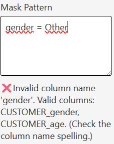

# 'Table Contents' settings Reference

## Overview


:::tip The **Table Contents** section controls what data is displayed in your table and how it's aggregated.
:::

## Table Type

**Setting**: Table type (Percentage or Mean)  
**Default**: Percentage

### Percentage Tables

Used to analyze distributions, proportions, and response rates.

**Available Displays**:
- **Values**: Raw count or sum
- **Vertical Percentage (%)**: Percentage within each column
- **Horizontal Percentage (%)**: Percentage within each row
- **Indice**: Index value (typically 100 = average)

**Example**: In a survey of 100 respondents:
```
            Very Satisfied    Satisfied    Neutral
North       45 (60%)         30 (40%)     25 (33%)
South       35 (47%)         45 (60%)     45 (60%)
Total       80 (53%)         75 (50%)     70 (47%)
```

### Mean Tables

Used to analyze averages and their statistical properties.

**Available Displays**:
- **Mean Values**: Average of the metric
- **Count**: Number of observations used in calculation
- **Standard Deviation**: Measure of variability
- **Indice**: Index based on mean values

**Example**: Average customer satisfaction score:
```
            Mean Score    Count    Std Dev
Product A   4.2          1250     0.8
Product B   4.5          980      0.7
```

---

## Display Options

### Values
**Label**: Show values  
**Type**: Toggle  
**Default**: Off

When enabled, displays the raw count or sum in each cell.

### Vertical Percentage
**Label**: Vertical percentage  
**Type**: Toggle  
**Default**: On

Shows each cell's value as a percentage of its column total. Useful for comparing across categories within groups.

### Horizontal Percentage
**Label**: Horizontal percentage  
**Type**: Toggle  
**Default**: Off

Shows each cell's value as a percentage of its row total. Useful for comparing category distribution within segments.

### Indice
**Label**: Show indice  
**Type**: Toggle  
**Default**: Off

Displays index values (typically with 100 as base). Useful for comparing relative performance against an average.

**Calculation**: `(Cell Value / Average) × 100`

---

## Masking

:::info WHY USE MASKING WHEN POWER BI CAN FILTER DATA?
When you filter data in Power BI, the underlying data is removed from the visual, which can affect calculations like totals and percentages. Masking allows you to hide specific data points **while still including them in calculations**, ensuring accurate results.
:::

---

### Mask Pattern
**Label**: Mask Pattern  
**Type**: Text area  
**Default**: Empty  
**Available in**: Pro, Premium editions

Allows you to mask (hide) data from specific rows or columns using regular expressions.



User will input a pattern to match the rows/columns to be hidden. As an example, if you want to show ONLY Brand A and Brand B, you need to high averything which is NOT Brand A or B.

```text
Label_Brand != BrandA AND Label_Brand != BrandB
```

or better with the IN operator


```text
NOT Label_Brand IN (BrandA, BrandB)
```

Therefore, if also you do not want the "No answer" to gender question while still using it in calculations:
```
(NOT Label_Brand IN (BrandA, BrandB)) OR Customer_Gender = "Not Stated"
```

etc ...
```text
(NOT Label_Brand IN (BrandA, BrandB)) OR (Customer_Gender IN ("Not Stated", Other))
```

:::caution Beware of the inverted logic of masking.
The pattern defines what to HIDE, this can be somewaht counter-intuitive at first.
:::

Valid operators are:
- IN - for multiple values
- AND - for logical conjunction
- OR - for logical disjunction
- NOT - for negation
- = - Equals
- != - Not equals
- \< - Less than
- \> - Greater than
- LIKE - Pattern matching with % wildcard

:::tip \<= and \>= does not exist
if you want to filter for years greater than or equal to 2020, you need to use `Year > 2019`
:::

The __*LIKE*__ operator works with the % symbol, for example:
```text
Customer_Gender LIKE %ale
```
Will hide M'ale' AND Fem'ale', and therefore show only "Not Stated" and "Other"

To show only Male **AND** Female, you need to invert the logic:
```NOT Customer_Gender LIKE %ale```

Will show ONLY Male and Female

**Use Cases**:
- Hide sensitive data in shared reports
- Remove small brands/categories from view
- Focus on top-performing segments
- Filter out "Other" or "Not answered" categories while still taking them into account for calculations

---

## Series Configuration

For detailed series configuration options (Value Series, Base Series, Mean Series, etc.), see:
- **[Percentage Series Usage](percentage-series.md)** — For percentage tables
- **[Mean Series Usage](mean-series.md)** — For mean tables

---


## Best Practices

1. **Choose Table Type First**: Percentage vs Mean fundamentally changes how data is displayed
2. **Limit Display Fields**: Use 2-3 display options maximum for clarity
3. **Use Masking Sparingly**: Masked data is still calculated but hidden
4. **Precision for Business**: Use 0-1 decimal places for most business reporting
5. **Totals Context**: Show totals to help readers understand the base size

---

## Related Settings

- [Totals Settings](totals.md) — Configure total rows and columns
- [Series Configuration](percentage-series.md) — Detailed data mapping
- [Sorting Options](sorting.md) — Arrange rows and columns

---

## Troubleshooting

**Q: Values appear as "0%" or very small numbers**  
A: Check that your base series is correctly mapped in percentage series settings.

**Q: Indice values don't look right**  
A: Ensure you've configured both values and base series correctly.

**Q: Mask pattern isn't working**  
A: Check your regular expression syntax. Use simple patterns like `Total` before complex regex.

For more help, see the [Quick Start Guide](../02-getting-started/quick-start.md).
