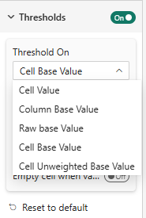
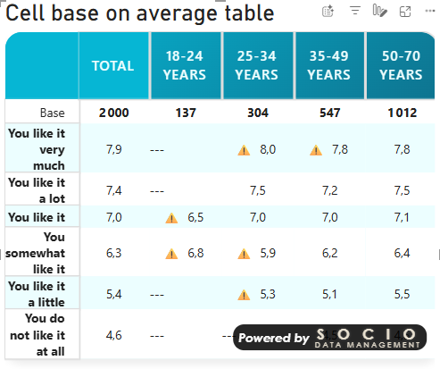
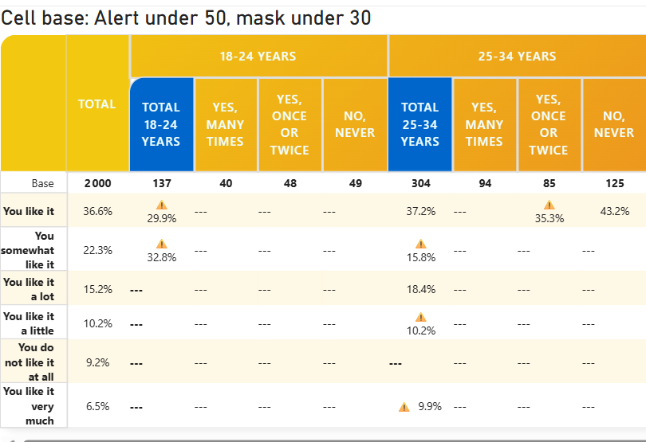
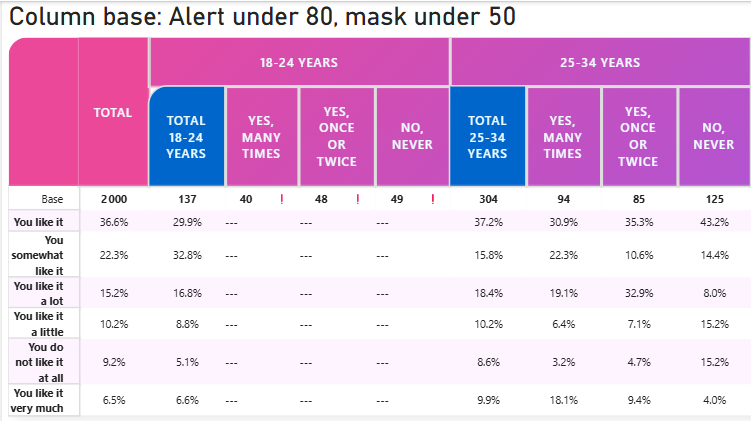

# Thresholds & Masking Reference

## Overview

In survey research, a figure computed on too few respondents is not reliable — and sometimes must not be shown at all (confidentiality, client rules, statistical honesty). The **Threshold** card automates this with two levels of protection:

- **Warning** — the value is displayed, but flagged with a ⚠️ symbol: *"interpret with caution"*.
- **Mask** — the value is replaced by `---`: *"not enough respondents to show this figure"*.

Both levels compare a reference value (which you choose — see [Threshold On](#threshold-on--choosing-what-is-tested)) against two numeric thresholds. A value below the **Mask Threshold** is masked; a value below the **Warning Threshold** (but at or above the mask threshold) gets the warning symbol.

:::note[Not to be confused with]
The **Mask Pattern** setting in the [Table contents](table-content.md#mask-pattern) card hides entire **columns by name** using an expression. Thresholds, on the other hand, act on **values** — they warn or mask figures based on sample size. The two features are independent.
:::

---

## Settings

**Location**: Format pane → **Threshold** card

| Setting | Type | Default | Description |
|---------|------|---------|-------------|
| **Use Thresholds** | Toggle | Off | Master switch for the whole card. |
| **Threshold On** | Dropdown | Cell Value | The reference value tested against the thresholds (see below). |
| **Warning Threshold** | Integer (supports *fx* rules) | 50 | Below this value, a ⚠️ symbol is shown next to the figure. |
| **Mask Threshold** | Integer (supports *fx* rules) | 30 | Below this value, the figure is replaced by `---`. |
| **Empty cell when value is zero** | Toggle | Off | Cells whose count is exactly 0 are rendered empty instead of showing `0` / `0%`. |

:::tip[Data-driven thresholds]
**Warning Threshold** and **Mask Threshold** both accept Power BI **conditional formatting rules** (the *fx* button). You can therefore drive the thresholds from a measure — for example a per-wave or per-country minimum base defined in your model.
:::

---

## Threshold On — choosing what is tested

This dropdown decides **which number is compared** to the two thresholds, and therefore **at which granularity** the warning/masking applies.

| Option | What is tested | Granularity | Typical use |
|--------|----------------|-------------|-------------|
| **Cell Value** | The value displayed in the cell (weighted count in a % table, **the mean itself** in a mean table) | Cell | Hide rare answer combinations in a frequency table. |
| **Column Base Value** | The **weighted base of the whole column** (the *Base* row) | Column | Mask every figure of a column whose base is too small. |
| **Column Unweighted Base Value** | The **unweighted (respondent) base of the whole column** (the *Unweighted Base* row) | Column | Same, but on real respondent counts — the usual statistical criterion. |
| **Cell Base Value** *(new)* | The **weighted base used to compute the cell** | Cell | Mean tables: mask a mean computed on a small weighted base. |
| **Cell Unweighted Base Value** *(new)* | The **unweighted (respondent) base of the cell** | Cell | The most rigorous cell-level criterion: the real number of people behind the figure. |

### Cell-level vs column-level

- The two **Column …** options test one number per column and apply the result to **every cell of that column**. When masking triggers, the whole column shows `---`; when only the warning triggers, the ⚠️ symbol is shown **on the base row only** (flagging the column without cluttering every cell).
- **Cell Value** and the two **Cell …** options test each cell independently: masking and the ⚠️ symbol apply cell by cell.

### Why the two new Cell Base options?

**Cell Value** tests the number that is displayed. That works naturally in a **percentage table**, where the underlying cell value is a weighted count. But in a **mean table**, the displayed value *is the mean* — so with `Cell Value` you would be comparing a *satisfaction score of 7.2* against a *base threshold of 30*, which is meaningless.

The two new options fix this by testing the cell's **calculation base** instead of its displayed value:

- **Cell Base Value** → the weighted base that weights the mean (or backs the percentage);
- **Cell Unweighted Base Value** → the raw number of respondents behind the cell.

They are also more precise in percentage tables: the weighted count of a cell is *not* its base (and even less its respondent count). If your masking rule is "no figure under 30 respondents", **Cell Unweighted Base Value** is the option that says exactly that.

:::tip[Recommended setups]
| Table type | Rule you want | Threshold On |
|------------|---------------|--------------|
| Percentages | "Don't show columns under N respondents" | Column Unweighted Base Value |
| Percentages | "Don't show any figure under N respondents" | Cell Unweighted Base Value |
| Means | "Don't show means computed on fewer than N respondents" | Cell Unweighted Base Value |
| Means (weighted rule) | "Don't show means whose weight is under N" | Cell Base Value |
:::

:::warning[Map the right series]
The base options read the **Base** / **Unweighted base** series of your table (see [Understanding Bases](understanding-bases.md)). If the corresponding series is not mapped in [Percentage Series](percentage-series.md) or [Mean Series](mean-series.md), the tested value is 0 and **everything gets masked**. If you suddenly see a table full of `---`, check the series mapping first.
:::

---

## Behavior in detail

### Warning (⚠️)

When the tested value is below the **Warning Threshold** but at or above the **Mask Threshold**:

- **Cell-level modes** — a ⚠️ symbol is prepended to the cell content.
- **Column-level modes** — the ⚠️ symbol is shown on the **Base** row (or **Unweighted Base** row) of the affected column; data cells stay clean.

### Mask (`---`)

When the tested value is below the **Mask Threshold**:

- Data cells display `---` instead of their content (in *tile* display mode, an empty tile is shown instead).
- **Base rows are never masked.** In column-level modes, the base row keeps its value and displays a red ❗ symbol — so you can always see *why* the column is masked.

### Empty cell when value is zero

With this toggle on, a cell whose count is exactly **0** is rendered completely empty (no `0`, no `0.0%`). This is a readability option, useful on sparse tables — an empty cell reads as "nobody", while `---` reads as "hidden". It takes precedence over masking: a zero cell is shown empty, not as `---`.

Note that this option is part of the Threshold card and only active while **Use Thresholds** is on.

---

## Interactions with other features

- **[Cell Rules](cell-rules.md)** cannot un-mask a cell: a threshold-masked cell keeps its `---`, although a rule can still decorate it (background, badge). If you need finer conditional logic than thresholds provide (e.g. color instead of masking, compound conditions on `base`/`uBase`), Cell Rules can express it — the rule context exposes the weighted `base` of the cell among its variables.
- **[Totals & base rows](totals.md)** — thresholds act on data cells; total rows are only affected by the column-level modes as described above (warning/alert symbols on the base rows, never masking).
- **Excel export** exports what is displayed: masked cells are exported as masked.

---

## Troubleshooting

- **Everything is masked (`---` everywhere)** → the tested series is missing or zero. Check that the *Base* / *Unweighted base* series required by your `Threshold On` choice is mapped ([Percentage Series](percentage-series.md), [Mean Series](mean-series.md)).
- **Means are masked/warned erratically** → you are probably on `Cell Value`, which tests the **mean itself** in a mean table. Switch to **Cell Unweighted Base Value** (or **Cell Base Value**).
- **A whole column is masked but its base looks fine** → you are on a **Column …** mode and looking at the *other* base row (weighted vs unweighted). The base row of the tested mode carries the red ❗.
- **I want to hide specific columns, not small ones** → that is [Mask Pattern](table-content.md#mask-pattern), not thresholds.

See [Understanding Bases](understanding-bases.md) for how bases are computed and aggregated, or the [Quick Start Guide](../02-getting-started/quick-start.md) to start building tables.
