# Totals & Subtotals Reference

## Overview

Configure total columns, base rows, and subtotals to provide context and summary information in your cross-tabulation tables.

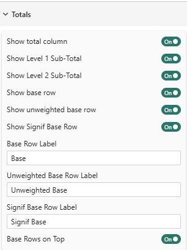
---

## Total Columns

### Show Table Total Column
**Setting**: Show Table Total Column  
**Type**: Toggle  
**Default**: On

Displays a total column that sums all values across the table.

**Position**: Appears as the first column (leftmost) in the table

**Example**:

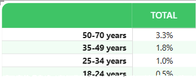


**Use Cases**:
- Quick reference to overall totals
- Comparing individual segments to total
- Understanding proportional contribution

### Show Level 1 Sub-Total
**Setting**: Show Level 1 Sub-Total  
**Type**: Toggle  
**Default**: On

Displays subtotal columns for the first level of column hierarchy.

**When It Appears**: Only when you have hierarchical columns (multiple column levels)

**Example**:


The blue "Total" columns show Level 1 subtotals.

### Show Level 2 Sub-Total
**Setting**: Show Level 2 Sub-Total  
**Type**: Toggle  
**Default**: On

Displays subtotal columns for the second level of column hierarchy.

**When It Appears**: Only when you have 3+ levels in column hierarchy

**Example**:

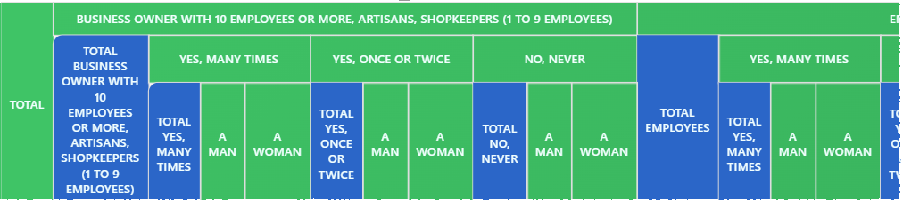

_This example shows both Level 1 and Level 2 subtotal columns._

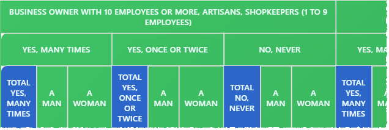

_This example shows Level 2 subtotal columns without Level 1._


---

## Base Rows

Base rows display the sample size or denominator used in calculations. Essential for understanding data reliability.

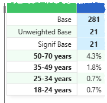

_The example shows the three different base rows available._

### Show Base Row
**Setting**: Show Base Row  
**Type**: Toggle  
**Default**: On

Displays a row showing the "Base" series selected in the [Percentage Series setting](./percentage-series) or [Mean Series setting](./mean-series).

**What It Shows**: 
- For percentage tables: The denominator used to calculate percentages
- For mean tables: The count of observations

**Example**:

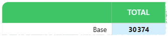

**Why It Matters**: 
- Small bases = less reliable percentages
- Helps readers judge statistical significance
- Required for proper interpretation

### Show Unweighted Base Row
**Setting**: Show Unweighted Base Row
**Type**: Toggle
**Default**: Off

Displays a row showing the unweighted (raw) sample size.

**When to Use**: 
- When your data is weighted in base series
- For transparency in research reporting
- To show actual number of obeservations/respondents

**Example**:

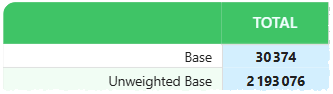

**Difference from Base**:
- **Base**: Reflects weighting adjustments
- **Unweighted**: Raw count of records/respondents

### Show Signif Base Row
**Setting**: Show Signif Base Row  
**Type**: Toggle  
**Default**: Off  
**Available in**: Premium

Displays a separate base row used specifically for significance testing calculations.

:::warning
This setting cannot be enabled unless you have set one significance method in the [Significance Testing settings](./significance).
:::

**When to Use**:
- When significance tests use different data than display values
- Complex weighting scenarios
- Specialized statistical testing

**Example**:

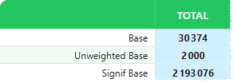

---

## Row Labels

Customize the text labels for base rows.

### Base Row Label
**Setting**: Base Row Label  
**Type**: Text input  
**Default**: "Base Row"

The label that appears for the weighted base row.

**Common Labels**:
- "Base"
- "Total N"
- "Sample Size"
- "Weighted Base"
- "n="

**Example**:

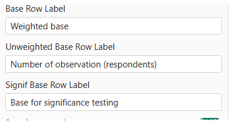
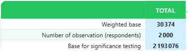


### Unweighted Base Row Label
**Setting**: Unweighted Base Row Label  
**Type**: Text input  
**Default**: "Unweighted Base"

The label for the unweighted base row.

**Common Labels**:
- "Unweighted n"
- "Raw Base"
- "Actual Count"
- "Sample (unwtd)"

### Signif Base Row Label
**Setting**: Signif Base Row Label  
**Type**: Text input  
**Default**: "Signif Base"  
**Available in**: Premium

The label for the significance testing base row.

**Common Labels**:
- "Signif n"
- "Test Base"
- "Statistical Base"

---

## Row Positioning

### Base Rows on Top of Table
**Setting**: Base Rows on Top  
**Type**: Toggle  
**Default**: On

Controls whether base rows appear at the top or bottom of the table.

**On (Default)**: Base rows appear immediately below headers


**Off**: Base rows appear at the bottom

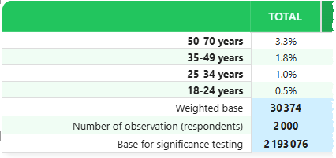


**Best Practices**:
- **Top**: Better for reports where base size is critical (research, surveys)
- **Bottom**: Cleaner look for executive dashboards
- **Top**: Standard in market research industry

---

## Practical Examples

### Example 1: Basic Survey Table
```
Configuration:
- Show Table Total Column: Yes
- Show Base Row: Yes
- Base Row Label: "Total Respondents"
- Base Rows on Top: Yes
```
Result:

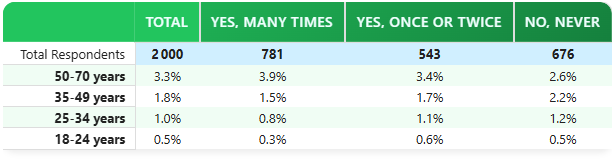

### Example 2: Weighted Research Study
```
Configuration:
- Show Table Total Column: Yes
- Show Base Row: Yes
- Show Unweighted Base Row: Yes
- Base Row Label: "Weighted Base"
- Unweighted Label: "Unweighted Base"
- Base Rows on Top: Yes
```

Result:

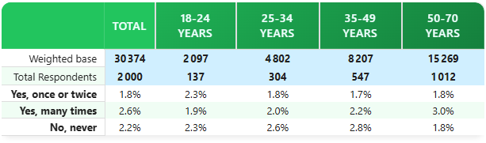

### Example 3: Multiple Row/Columns Analysis
```
Configuration:
- Show Table Total Column: Yes
- Show Level 1 Sub-Total: Yes
- Show Level 2 Sub-Total: Yes
- Show Base Row: Yes
- Base Rows on Top: Yes

```

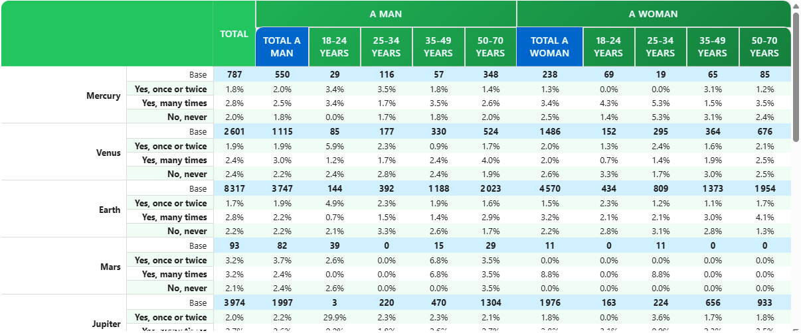


### Example 4: Clean Dashboard Style
```
Configuration:
- Show Table Total Column: No
- Show Base Row: Yes
- Base Row Label: "n="
- Base Rows on Top: No
- Table Style: Market research
```

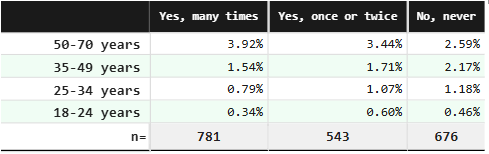

---

## Best Practices

### 1. Always Show Base Rows
Base rows are critical for proper interpretation. Only hide them if:
- Space is extremely limited
- Audience is very familiar with the data
- Bases are identical across all columns

### 2. Unweighted Bases for Research
When reporting weighted data:
- Always show both weighted and unweighted bases
- Label them clearly to avoid confusion
- Place unweighted base directly below weighted base

### 3. Label Clarity
Use industry-standard labels:
- **Market Research**: "Base", "Unweighted Base"
- **Academic**: "N", "n (unweighted)"
- **Business**: "Total", "Sample Size"

### 4. Position Based on Audience
- **Research/Technical**: Bases on top
- **Executive/Business**: Consider bases on bottom
- **Reports with many rows**: Bases on top for reference

### 5. Subtotals in Hierarchies
Enable Level 1 and Level 2 subtotals when:
- You have 2+ levels of column grouping
- Subtotals provide meaningful insights
- Table isn't too wide already

---

## Common Configurations

### Standard Market Research
```
- Show Table Total: Yes
- Show Base Row: Yes
- Show Unweighted Base: Yes
- Base Label: "Weighted Base"
- Unweighted Label: "Unweighted Base"
- Position: Top
```

### Business Dashboard
```
- Show Table Total: No (or Yes, depends)
- Show Base Row: Yes
- Base Label: "Total"
- Position: Top or Bottom
- Level 1 Subtotals: As needed
```

### Academic/Scientific
```
- Show Base Row: Yes
- Show Unweighted Base: No (unless weighted)
- Base Label: "N"
- Position: Top
- Include significance testing base if relevant
```

### Executive Summary
```
- Show Table Total: Yes
- Show Base Row: Yes
- Base Label: "Sample"
- Position: Bottom
- Minimal detail, clean look
```

---

## Data Series Configuration

For base rows to display correctly, ensure proper series mapping:

### For Percentage Tables
- **Base Series**: Set in "% series usage" settings
- **Unweighted Base Series**: Set in "% series usage"
- **Signif Base Series**: Set in "% series usage" (if using significance)

### For Mean Tables
- **Count Series**: Set in "Mean series usage" (acts as base)
- **Unweighted Base Series**: Set in "Mean series usage"

See [Percentage Series](percentage-series.md) and [Mean Series](mean-series.md) for detailed configuration.

---

## Statistical Context

### Why Base Sizes Matter

**Small Bases (\<30)**:
- Percentages are unreliable
- Use thresholds to mask or warn
- Consider combining categories

**Medium Bases (30-100)**:
- Percentages acceptable but note limitations
- Significance tests may not detect real differences

**Large Bases (100+)**:
- Reliable percentages
- Significance tests have good power

### Weighted vs Unweighted

**Weighted Base**:
- Adjusted to match population proportions
- Use for percentage calculations
- May differ significantly from raw count

**Unweighted Base**:
- Actual number of records/respondents
- Use to judge reliability
- Important for transparency

**Rule of Thumb**: Show both when weighting is applied.

---

## Troubleshooting

**Q: Base row doesn't appear**  
A: Ensure you've mapped the Base Series in percentage/mean series settings

**Q: Unweighted base is identical to weighted base**  
A: Your data likely isn't weighted; consider hiding unweighted row

**Q: Base values look wrong**  
A: Check series mapping; ensure you're using the correct measure

**Q: Subtotals don't appear**  
A: Subtotals only show with hierarchical column structures (2+ levels)

**Q: Can I show bases in cells instead of rows?**  
A: No, bases are always shown as separate rows; consider custom formatting

**Q: Base rows break my table layout**  
A: Try positioning them at bottom, or reduce font size in formatting

---

## Related Settings

- [Table Contents](table-content.md) — Overall table configuration
- [Percentage Series](percentage-series.md) — Map base data series
- [Mean Series](mean-series.md) — Configure count series
- [Thresholds](thresholds.md) — Mask low base values

---

For more help, see the [Quick Start Guide](../02-getting-started/quick-start.md) or contact support.
