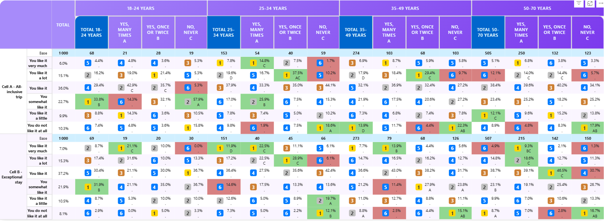

# Welcome to SDM Cross Table Tool by Socio Data Management

## Professional Cross-Tabulation Tables for Power BI

The **Socio Data Management Cross Table Tool for Power BI** is a powerful custom visual component designed to create sophisticated cross-tabulation tables with advanced analytics capabilities. Whether you're working with survey data, business metrics, or complex datasets, SDM Cross Table Tool provides the tools you need to visualize, analyze, and present your data with professional styling and precision.

### What You Can Do

- **Create Dynamic Cross-Tabs**: Build percentage and mean-based tables with hierarchical columns and rows
- **Advanced Styling**: Apply custom formatting, colors, fonts, and visual emphasis to highlight key insights
- **Statistical Testing**: Perform significance tests to identify meaningful differences in your data
- **Ranking & Indexing**: Automatically rank cells and calculate indices for comparative analysis
- **Flexible Thresholds**: Warn or mask values based on customizable business rules
- **Interactive Selection**: Allow users to select rows and columns for dynamic filtering
- **Professional Output**: Export to Excel with preserved formatting

### Get Started

Choose your path:

- **New to SDM Cross Table Tool?** Start with [Installation & Quick Start](02-getting-started/quick-start.md)
- **Want to see it in action?** Check out our [Use Cases & Business Examples](03-use-cases/business-cases.md)
- **Need detailed options?** Explore the [Complete Reference Guide](04-reference/table-content.md)
- **Comparing editions?** See what's included in [Free & Pro](01-introduction/editions.md)

---

### Feature Highlights

✨ **Rich Formatting** — Customize every aspect of your table  
📊 **Statistical Analysis** — Built-in significance testing  
🎯 **Smart Sorting** — Sort by value, alphabetically, or custom rules  
🌈 **Visual Ranking** — Color gradients and ranked labels  
🔍 **Threshold Controls** — Mask or warn on values below thresholds  
📈 **Multiple Aggregations** — Support for percentages and means  
👆 **Interactive Selection** — Let users filter by clicking rows and columns

---

**Ready to create your first cross-tab table?** [Let's go →](02-getting-started/quick-start.md)
